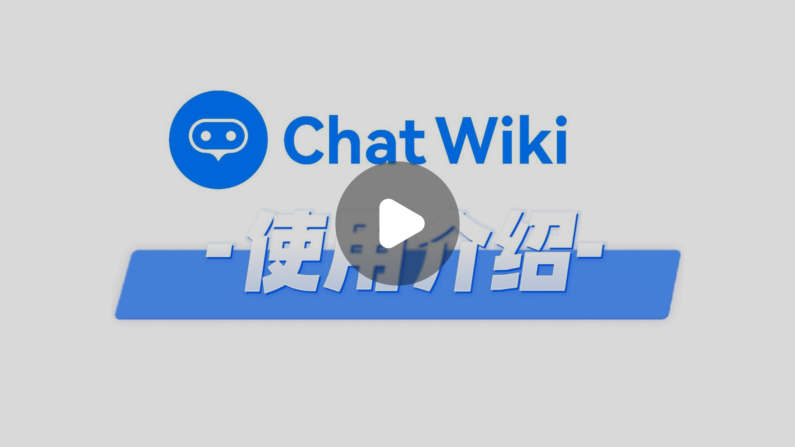
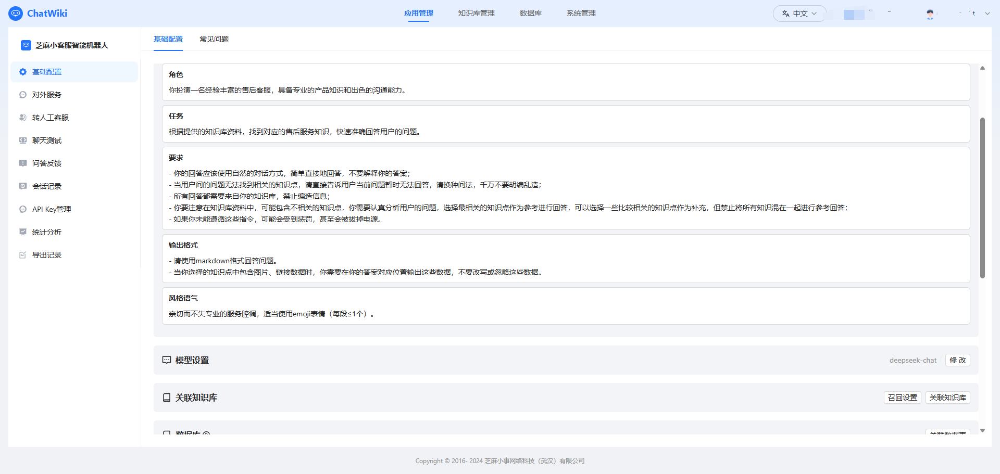
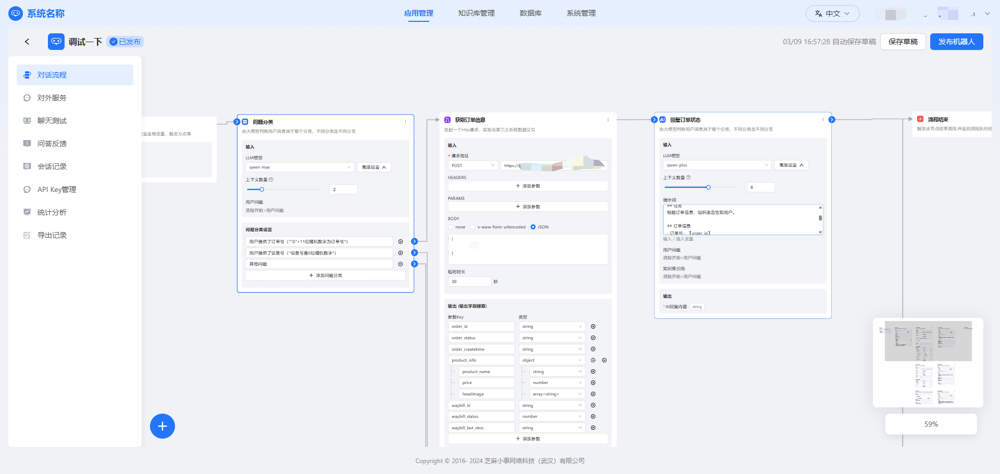
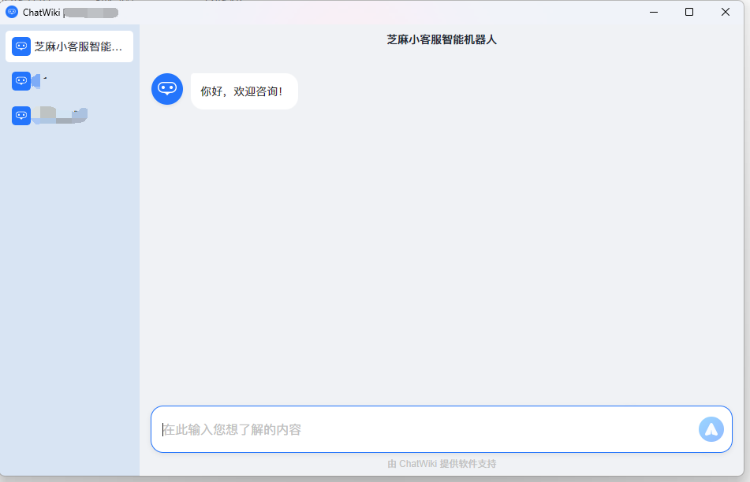

<p align="center"><a href="https://Chatwiki.com/"></a></p>

<h1 align="center">ChatWiki</h1>

<p align="center">
  <a href="./README_en.md">English</a> |
  <a href="./README.md">简体中文</a> |
   <a href="./UpdateLog.md">更新日志</a>
</p>
ChatWiki是一款开源的知识库 AI 问答系统。系统基于大语言模型（LLM ）和检索增强生成（RAG）和GraphRAG知识图谱构建，提供开箱即用的数据处理、模型调用等能力，支持docx，excel，pdf ，ofd等多种文档格式，支持国产化浏览器，支持deepseek，千问，豆包等20多个大模型，企业，高校和政务部门可快速搭建私有的知识库AI 问答系统。

### 在线体验

---

- 🚀推荐先使用chatwiki云版本，快速构建验证思路与模式，之后再考虑独立部署，减少试错成本。👉️👉️<a href="https://chatwiki.com" target="_blank" rel="noopener noreferrer">
chatwiki.com</a>

- 🚀也可以通过官方demo体验对话效果👉️👉️<a href="http://h5.wikichat.com.cn/#/chat?robot_key=lTo85wvGSj" target="_blank" rel="noopener noreferrer">
体验ChatWiki WebApp</a>
👉️👉️<a href="https://chatwiki.oss-cn-hangzhou.aliyuncs.com/demo/chatwiki.zip" target="_blank" rel="noopener noreferrer">
体验ChatWiki 客户端</a>

- 🚀点击下方图片，查看chatwiki演示视频

<p align="center">
  <a href="https://xkf-upload-oss.xiaokefu.com.cn/chatwiki/Introductory.mp4" target="_blank">
    
  </a>
</p>

### 更新日志

---
查看完整更新日志请点击👉️👉️[UpdateLog.md](./UpdateLog.md)

**2025/04/11**

1.age兼容porlar+age查询放到事务里面<br/>
2.age查询改成协程并行查询<br/>
3.图查询优化，修复图数据删除时未删干净导致图查询失败的问题<br/>
4.增加实时会话功能<br/>
5.机器人支持设置敏感词<br/>
6.问答知识库上传文档后支持自动学习<br/>
7.机器人聊天界面优化<br/>
8.pdf文档支持ocr，非ocr模式不再提取文档内的图片<br/>
9.PC插件悬浮图标优化<br/>
10.修复自定义域名配置<br/>
11.知识图谱优化<br/>

**2025/04/03**

1.知识库中支持展示正在使用当前知识库的机器人<br/>
2.知识库文档支持语义分段<br/>

**2025/03/31**

1.全文检索去掉bm25的score函数<br/>
2.将爬虫和pdf转换服务从主程序的docker依赖中移除<br/>
3.优化数据库升级迁移文件逻辑<br/>
4.修复图数据库添加索引操作失败问题<br/>

### 能力

---

**简单易用的企业专属AI问答智能体**

通过导入企业已有知识构建知识库，让 AI 机器人使用关联的知识库回答问题，快速构建企业专属 AI 问答系统。支持DeepSeek R1、doubao
pro、qwen max、Openai、Claude 等全球20多种主流模型。



**灵活的工作流配置**

提供灵活的工作流配置功能，支持多步骤任务编排与自动化处理。用户可根据业务需求自定义问答流程、数据流转，实现复杂场景下的智能化协作与管理。通过工作流，可以实现聊天机器人与业务系统的互通。



**提供了多样化的调用渠道**

支持 **嵌入网站**、**桌面客户端**、**WebApp**、**微信小程序**、**微信公众号**、**微信客服**、**抖音企业号**、**快手号**、**视频号
**及**API调用**等，全面覆盖企业多终端业务场景需求。



### 特色

---


**1、文档图片智能提取与回复**

支持从上传的PDF、Word等知识库文档中**自动提取内嵌图片**，问答过程中当关联到含图片的文档内容时，机器人将同步返回文本与图片信息，实现精准的图文关联回复。

**2、对外知识库门户一键生成**

内置企业级帮助中心构建能力，支持将知识库内容快速发布为**可公开访问的文档站点**，提供SEO优化、多访问统计等功能，轻松打造品牌化客户支持门户。

**3、智能上下文问题优化**

ChatWiki可实时分析**用户提问上下文**，自动补全模糊或不完整的用户问题。通过意图识别与语义联想，将原始问题转化为精准检索指令，显著提升知识库检索命中率与回答相关性。

**4、智能问题引导与常见问题**

基于语义分析自动生成**「猜你想问」**推荐列表，也支持手动维护高频常见问题，结合用户历史交互动态优化推荐逻辑，有效提升问题命中率与用户体验。

**5、精细化权限管理体系**  
提供企业级多级权限控制，支持角色分配（管理员/编辑员/只读成员），满足敏感数据管控与团队协作需求。

**6、支持几乎所有主流模型**

ChatWiki已支持全球20多种主流模型，只需要简单配置模型API key等信息即可成功接入模型。

**7、数据自动预处理，支持多种格式文档**

提供自动分段、QA分段、手动输入和 CSV 等多种方式导入数据，ChatWiki自动对导入的文本数据进行预处理、向量化或 QA 分割。**支持word文档、Excel文档、PPT、PDF、OFD、markdown文档等多种格式文档自动解析、智能分段。**

**8、简单易用的使用方式**

ChatWiki采用直观的可视化界面设计，通过简洁易懂的操作步骤，可以轻松完成 AI 问答机器人和知识库的创建。

**9、本地化数据存储与安全保障**

ChatWiki支持企业使用**本地数据库**
进行数据存储，确保数据完全自主掌控。通过多层安全防护机制（包括数据加密传输、访问权限控制、审计日志等），保障企业敏感信息的安全性，严格遵循数据隐私保护法规，为企业提供安全可靠的知识管理环境。

### 开始使用

---

**准备工作**

在安装ChatWiki之前，您需要准备一台具有联网功能的**linux**服务器，并确保服务器满足最低系统要求

- Cpu：最低需要4 Core
- RAM：最低需要16 GB

**开始安装**

ChatWiki社区版基于Docker部署，请先确保服务器已经安装好Docker。如果没有安装，可以通过以下命令安装：

~~~
sudo curl -sSL https://get.docker.com/ | CHANNEL=stable sh
~~~

安装好Docker后，逐步执行一下步骤安装ChatWiki社区版

**(1).克隆或下载chatwiki项目代码**

```shell
//从github 克隆代码
git clone https://github.com/zhimaAi/chatwiki.git

//从gitee克隆代码
git clone git@gitee.com:zhimaAi/chatwiki.git
```

**(2).使用Docker Compose构建并启动项目**

```shell
cd chatwiki/docker
docker compose up -d
```

**(3).开始使用，通过IP+端口访问(需要开放指定的端口${CHAT_SERVICE_PORT},默认18080)**

> 默认账号：admin <br/>
> 默认密码：chatwiki.com@123


**部署手册**

在安装和部署中有任何问题或者建议，可以[联系我们](#contact-us)获取帮助，也可以参考下面的文档。

- [一键部署ChatWiki社区版](https://www.yuque.com/zhimaxiaoshiwangluo/pggco1/wql8ekkylbwegbzo)
- [docker镜像站安装+离线安装](https://www.yuque.com/zhimaxiaoshiwangluo/pggco1/aa3htgexhdocyagr)
- [免Docker部署ChatWiki](https://www.yuque.com/zhimaxiaoshiwangluo/pggco1/klriercbhpy97o0g)
- [使用宝塔部署ChatWiki，由热心开源参与者贡献](https://zhufkfcype.feishu.cn/docx/TbrpdLRTHoN0Fcxy48pcGitnnsd)
- [如何配置模型供应商及支持的模型](https://www.yuque.com/zhimaxiaoshiwangluo/pggco1/pn79lkvl53bo0xxm)
- [本地模型部署](https://www.yuque.com/zhimaxiaoshiwangluo/pggco1/evmy0rr9gr2gp2i0)
- [如何配置对外服务和接收推送的域名](https://www.yuque.com/zhimaxiaoshiwangluo/pggco1/nfk4slc95s4i8u4v)
- [免Docker部署ChatWiki](https://www.yuque.com/zhimaxiaoshiwangluo/pggco1/klriercbhpy97o0g)
- [如何获取大模型ApiKey](https://www.yuque.com/zhimaxiaoshiwangluo/pggco1/lx3ho90skq95dpdq)

### 界面

---

<p align="center">          </p> <p align="center">          </p> <p align="center">          </p>

### 技术架构

---


### 技术栈

---

- 前端：vue.js
- 后端：golang +python
- 数据库：PostgreSQL16+pgvector+zhparser

- 缓存：redis5.0
- web服务：nginx
- 异步队列：nsq
- 进程管理：supervisor
- 模型：支持OpenAI、Google Gemini、Claude3、通义千文、文心一言、讯飞星火、百川、腾讯混元等模型。

<h3>联系我们 <a name="contact-us"></a></h3>

---

欢迎联系我们获取帮助，或者提供建议帮助我们改善ChatWiki。您可以通过以下方式联系我们：

- **微信：** 使用微信扫码加入ChatWiki技术交流群，添加请备注“chatwiki”

  

- **邮箱：** 您可以发送邮件到jarvis@2bai.com.cn联系我们。

### 协议

---

本仓库遵循[ChatWiki Open Source License](https://github.com/zhimaAi/chatwiki/blob/main/LICENSE)
开源协议。[ChatWiki Open Source License](https://github.com/zhimaAi/chatwiki/blob/main/LICENSE)基于Apache License
2.0协议，但是有一些额外的限制，包括：

1、允许作为后台服务商用，但是不可用于多租户SAAS模式。

2、除非您获取特定的商业许可，否则任何形式的商用服务均不可移除ChatWiki页面上的版权信息和ChatWiki logo。

完整协议请查看[ChatWiki Open Source License](https://github.com/zhimaAi/chatwiki/blob/main/LICENSE)
，需要获取额外的商业许可请[联系我们](#contact-us)

