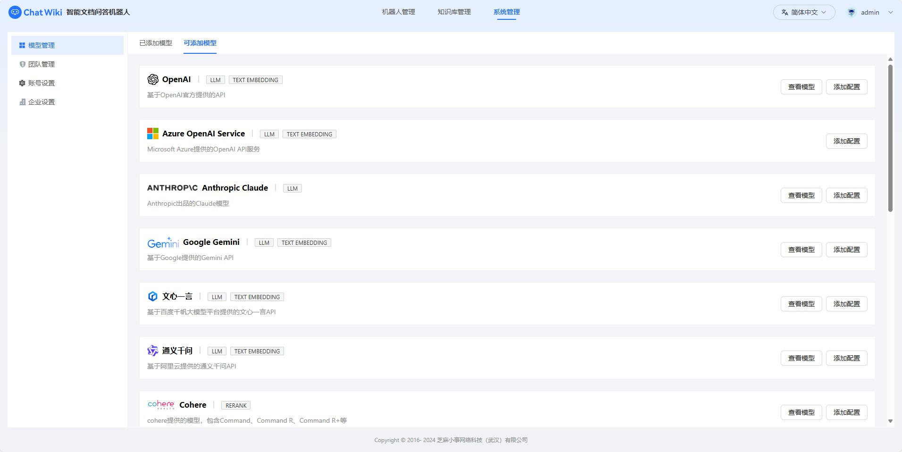
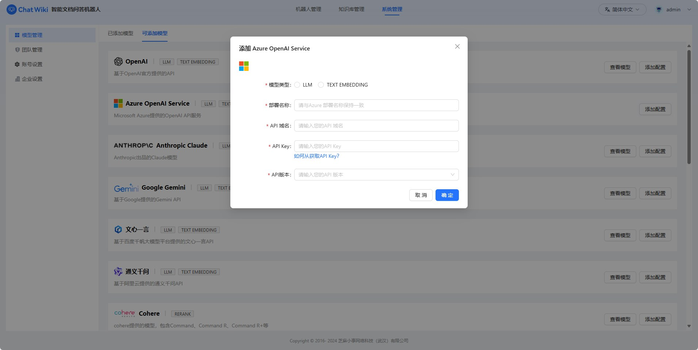
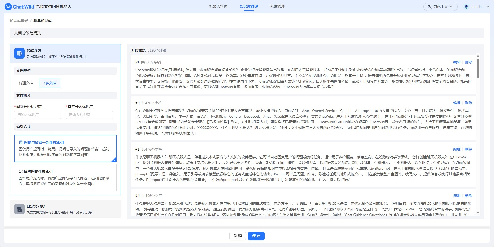
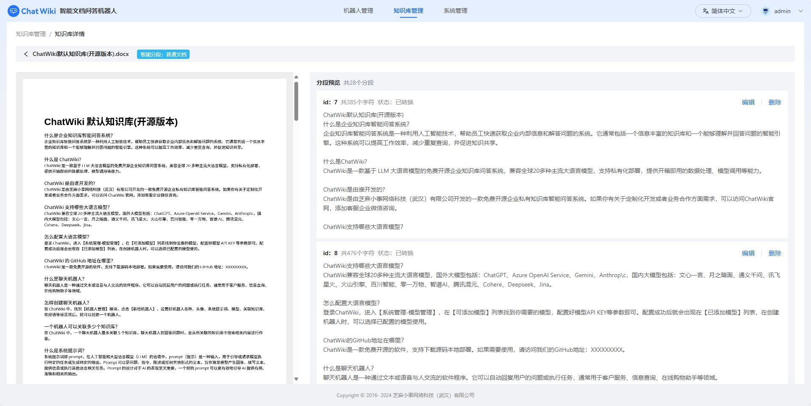
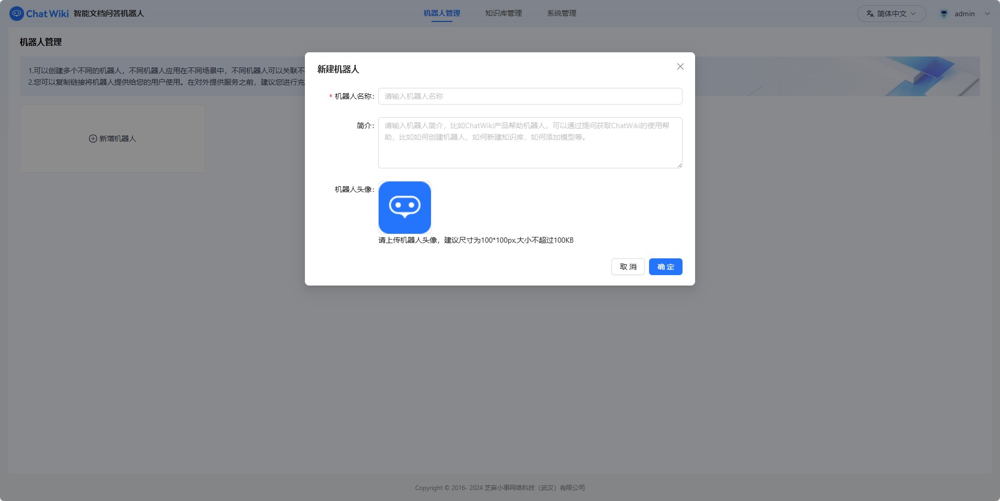
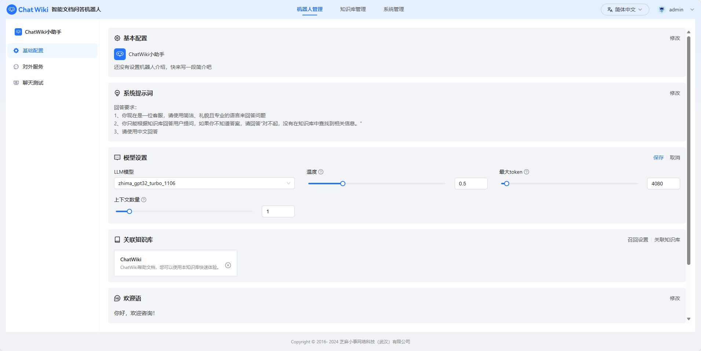
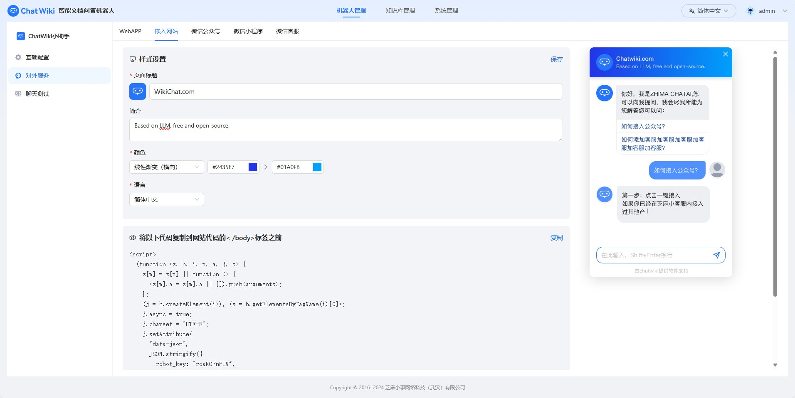
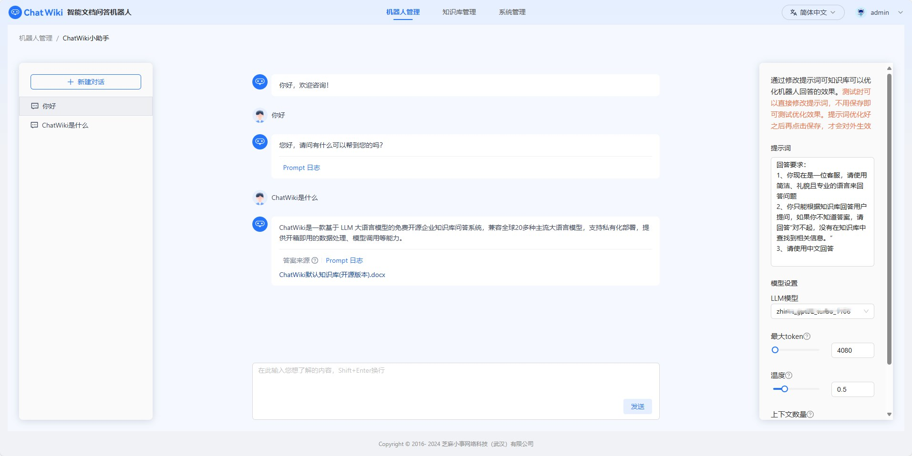
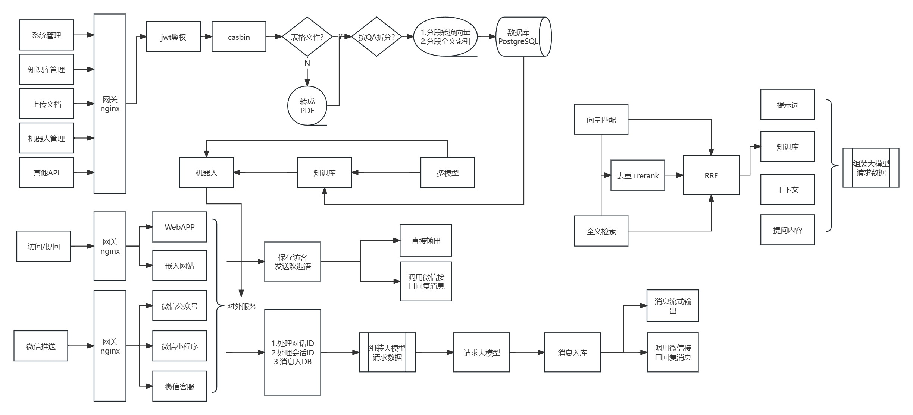
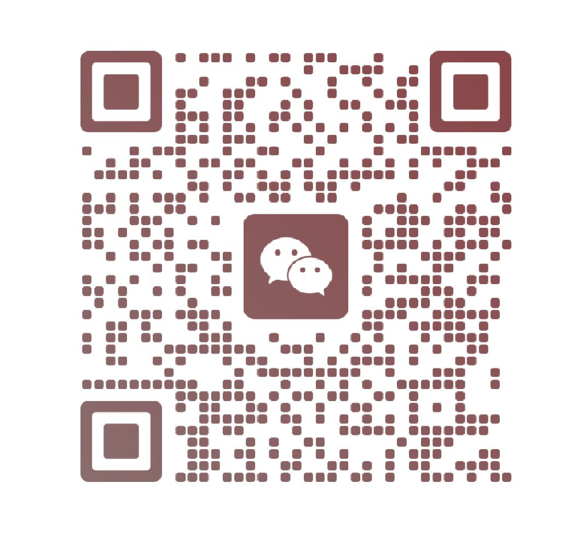

<p align="center"><a href="https://Chatwiki.com/"></a></p>

<h1 align="center">ChatWiki</h1>

<p align="center">
  <a href="./README_en.md">English</a> |
  <a href="./README.md">简体中文</a> |
   <a href="./UpdateLog.md">更新日志</a>
</p>

ChatWiki是一款开源的知识库 AI 问答系统。系统基于大语言模型（LLM ）和检索增强生成（RAG）技术构建，提供开箱即用的数据处理、模型调用等能力，可以帮助企业快速搭建自己的知识库
AI 问答系统。

### 能力

---

**1、专属 AI 问答系统**

通过导入企业已有知识构建知识库，让 AI 机器人使用关联的知识库回答问题，快速构建企业专属 AI 问答系统。

**2、一键接入模型**

ChatWiki已支持全球20多种主流模型，只需要简单配置模型API key等信息即可成功接入模型。

**3、数据自动预处理**

提供自动分段、QA分段、手动输入和 CSV 等多种方式导入数据，ChatWiki自动对导入的文本数据进行预处理、向量化或 QA 分割。

**4、简单易用的使用方式**

ChatWiki采用直观的可视化界面设计，通过简洁易懂的操作步骤，可以轻松完成 AI 问答机器人和知识库的创建。

**5、适配不同业务场景**

ChatWiki为 AI 问答机器人提供了不同的使用渠道，支持H5链接、嵌入网站、桌面客户端等，可以满足企业不同业务场景使用需求。

### 开始使用

---

**准备工作**

再安装ChatWiki之前，您需要准备一台具有联网功能的**linux**服务器，并确保服务器满足最低系统要求

- Cpu：最低需要2 Core
- RAM：最低需要4GB

**开始安装**

ChatWiki社区版基于Docker部署，请先确保服务器已经安装好Docker。如果没有安装，可以通过以下命令安装：

~~~
sudo curl -sSL https://get.docker.com/ | CHANNEL=stable sh
~~~

安装好Docker后，逐步执行一下步骤安装ChatWiki社区版

**(1).克隆或下载chatwiki项目代码**

```shell
git clone https://github.com/zhimaAi/chatwiki.git
```

**(2).使用Docker Compose构建并启动项目**

```shell
cd chatwiki/docker
docker-compose up -d
```

**部署手册**

在安装和部署中有任何问题或者建议，可以[联系我们](#contact-us)获取帮助，也可以参考下面的文档。

- [一键部署ChatWiki社区版](https://www.yuque.com/zhimaxiaoshiwangluo/pggco1/wql8ekkylbwegbzo)
- [如何配置模型供应商及支持的模型](https://www.yuque.com/zhimaxiaoshiwangluo/pggco1/pn79lkvl53bo0xxm)
- [本地模型部署](https://www.yuque.com/zhimaxiaoshiwangluo/pggco1/evmy0rr9gr2gp2i0)
- [如何配置对外服务和接收推送的域名](https://www.yuque.com/zhimaxiaoshiwangluo/pggco1/nfk4slc95s4i8u4v)
- [免Docker部署ChatWiki](https://www.yuque.com/zhimaxiaoshiwangluo/pggco1/klriercbhpy97o0g)
- [如何获取大模型ApiKey](https://www.yuque.com/zhimaxiaoshiwangluo/pggco1/lx3ho90skq95dpdq)

### 界面

---

<p align="center">          </p> <p align="center">          </p> <p align="center">          </p>

### 技术架构

---



### 技术栈

---

- 前端：vue.js
- 后端：golang +python
- 数据库：PostgreSQL16+pgvector+zhparser

- 缓存：redis5.0
- web服务：nginx
- 异步队列：nsq
- 进程管理：supervisor
- 模型：支持OpenAI、Google Gemini、Claude3、通义千文、文心一言、讯飞星火、百川、腾讯混元等模型。

<h3>联系我们 <a name="contact-us"></a></h3>

---

欢迎联系我们获取帮助，或者提供建议帮助我们改善ChatWiki。您可以通过以下方式联系我们：

- **微信：** 使用微信扫码加入ChatWiki技术交流群

  

- **邮箱：** 您可以发送邮件到jarvis@2bai.com.cn联系我们。

### 协议

---

本仓库遵循[ChatWiki Open Source License](https://github.com/zhimaAi/chatwiki/blob/main/LICENSE)
开源协议。[ChatWiki Open Source License](https://github.com/zhimaAi/chatwiki/blob/main/LICENSE)基于Apache License
2.0协议，但是有一些额外的限制，包括：

1、允许作为后台服务商用，但是不可用于多租户SAAS模式。

2、除非您获取特定的商业许可，否则任何形式的商用服务均不可移除ChatWiki页面上的版权信息和ChatWiki logo。

完整协议请查看[ChatWiki Open Source License](https://github.com/zhimaAi/chatwiki/blob/main/LICENSE)
，需要获取额外的商业许可请[联系我们](#contact-us)

