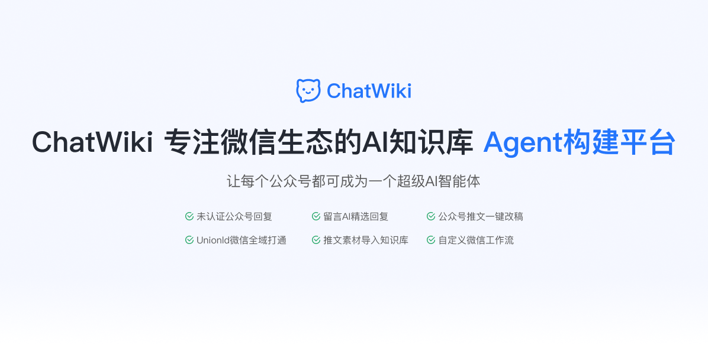
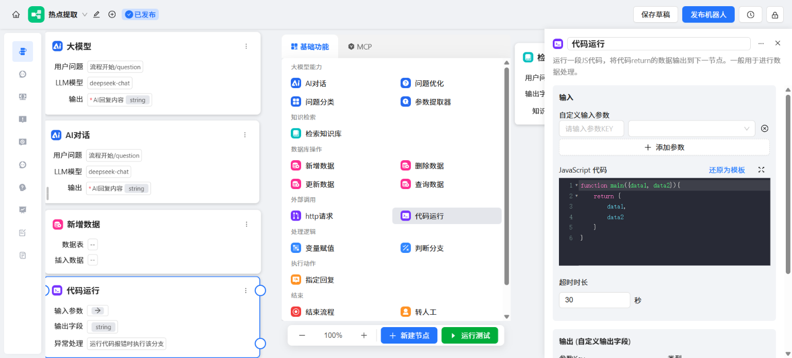
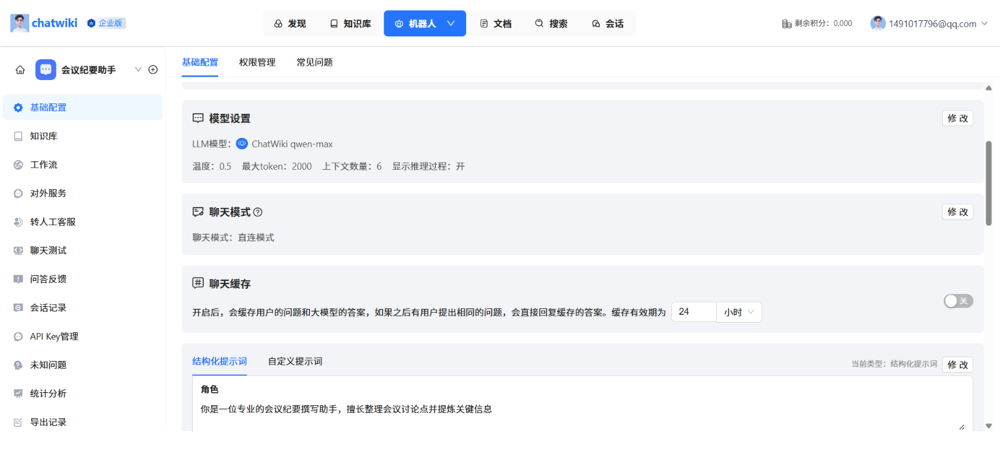
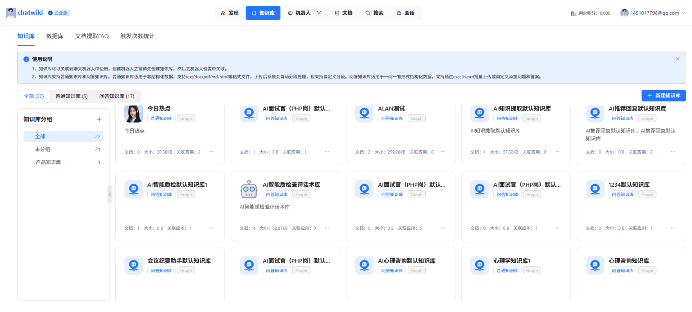
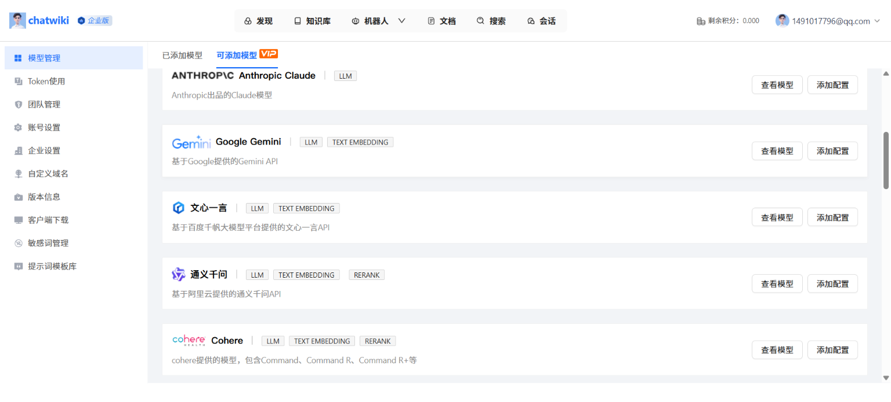

<p align="center"><a href="https://Chatwiki.com/"></a></p>

<p align="center">
  <a href="./README_en.md">English</a> |
  <a href="./README.md">简体中文</a> |
  <a href="./UpdateLog.md">更新日志</a> |
  <a href="https://www.yuque.com/zhimaxiaoshiwangluo/pggco1/ykeoauc4g9k2dwv1">帮助文档</a>
</p>

## 🎯 产品定位

ChatWiki 是一个专注微信生态的工作流自动化平台，致力于让每个公众号都可成为一个超级AI智能体。全面集成公众号平台的开放能力，拖拽即可搭建微信生态应用，实现公众号推文一键改稿、留言AI精选回复等能力


## ✨ 核心特性

### 💬 微信生态深度集成

- **全行业首创**：未认证公众号私信自动回复，支持文本、语音、图片、小程序卡片、视频消息等。

- **微信工作流**：集成用户私信、留言、关注、取关、点击菜单等触发场景，支持回复私信，粉丝打标签，生成草稿文章、发布文章等多种处理流程

- **知识库同步**：支持抓取公众号文章素材，一键建立知识库。

### 🤖 基础能力

- **工作流编排：** 对话工作流、插件工作流，包含基础的工作流节点、双向 MCP、Agent 模式、用户交互。

- **文档知识库：** 支持 url 读取、文档批量导入、API 对接、支持AI分段、QA分段、父子分段。支持知识图谱、向量混合检索，可视化查看知识图谱。

- **问答知识库：** 上传文档自动抽取问答知识，支持未知问题自动聚类，支持从人工对话中总结常用FAQ

- **转人工客服：** 通过机器人处理一般的用户咨询，同时支持人工客服接待。机器人处理不好的问题可以由人工客服介入处理，支持多客服协同分配。

- **模型支持：** 支持DeepSeek R1、doubao pro、qwen max、Openai、Claude 等全球20多种主流模型。

### 🌐 更多能力

- **多种部署方式**：提供桌面客户端、支持发布为WebApp，支持嵌入网站、公众号服务号、微信客服、微信小店客服等

- **MCP&API集成**：可引入外部MCP服务，或将工作流发布为MCP服务。完整的OpenAPI接口，轻松集成现有业务系统。

- **多账号权限管理**：管理、编辑、查看三级权限体系，实现数据权限隔离。IP白名单、登录日志永久留存。

## 🛸UI

- 🌍**免费体验网址**： [chatwiki.com](https://chatwiki.com/)
- 🖼️**系统截图**：

<p align="center">       </p> 
<p align="center">       </p> 

## 🚀 一键部署

ChatWiki 社区版基于 Docker 部署，只需简单几步即可完成安装：

```
# 安装 Docker
sudo curl -sSL https://get.docker.com/ | CHANNEL=stable sh
# 克隆项目
git clone https://github.com/zhimaAi/chatwiki.git
cd chatwiki/docker
# 启动服务
docker compose up -d
# 开始使用，通过IP+端口访问(需要开放指定的端口${CHAT_SERVICE_PORT},默认18080)
# 默认账号：admin
# 默认密码：chatwiki.com@123
```

在安装和部署中有任何问题或者建议，可以 [联系我们](https://github.com/zhimaAi/chatwiki?tab=readme-ov-file#contact-us)
或者查看 [帮助文档](https://www.yuque.com/zhimaxiaoshiwangluo/pggco1?source=aHR0cHM6Ly9jaGF0d2lraS5jb20v)
获取帮助，也可以参考下面的文档。

- [通过chatwiki安装助手安装](https://www.yuque.com/zhimaxiaoshiwangluo/pggco1/tvwn5npk63aqikq1)

- [一键部署ChatWiki社区版](https://www.yuque.com/zhimaxiaoshiwangluo/pggco1/wql8ekkylbwegbzo)

- [docker镜像站安装+离线安装](https://www.yuque.com/zhimaxiaoshiwangluo/pggco1/aa3htgexhdocyagr)

- [免Docker部署ChatWiki](https://www.yuque.com/zhimaxiaoshiwangluo/pggco1/klriercbhpy97o0g)

- [宝塔Linux面板部署ChatWiki社区版](https://www.yuque.com/zhimaxiaoshiwangluo/pggco1/gefgwdfnclua7d9y)

- [使用1Panel部署ChatWiki社区版](https://www.yuque.com/zhimaxiaoshiwangluo/pggco1/munvto5g1ctc1gcu)

- [如何配置模型供应商及支持的模型](https://www.yuque.com/zhimaxiaoshiwangluo/pggco1/pn79lkvl53bo0xxm)

- [本地模型部署](https://www.yuque.com/zhimaxiaoshiwangluo/pggco1/evmy0rr9gr2gp2i0)

- [如何配置对外服务和接收推送的域名](https://www.yuque.com/zhimaxiaoshiwangluo/pggco1/nfk4slc95s4i8u4v)

- [如何获取大模型ApiKey](https://www.yuque.com/zhimaxiaoshiwangluo/pggco1/lx3ho90skq95dpdq)

## 💻 技术栈

----

- 前端：vue.js

- 后端：golang +python

- 数据库：PostgreSQL16+pgvector+zhparser

## 🏡社区交流&联系我们

----
欢迎联系我们获取帮助，或者提供建议帮助我们改善ChatWiki。您可以通过以下方式联系我们：

- **帮助：** 查看 [帮助文档](https://www.yuque.com/zhimaxiaoshiwangluo/pggco1?source=aHR0cHM6Ly9jaGF0d2lraS5jb20v)
- **邮箱：** 您可以发送邮件到 [jarvis@2bai.com.cn](mailto:jarvis@2bai.com.cn)联系我们。
- **微信：** 使用微信扫码加入ChatWiki技术交流群，添加请备注“chatwiki”

<p align="left"></a></p>

## 📖**更新日志**

---
查看完整更新日志请点击👉️👉️[UpdateLog.md](./UpdateLog.md)

**2025/11/28**

1.工作流页面交互优化-实现自动整理功能<br/>
2.工作流节点插件-支持企微，钉钉，飞书通知<br/>
3.重构微信推送消息结构体引用路径<br/>
4.修复创建对外文档时校验了model相关配置提示参数错误问题<br/>
5.对外服务-钉钉机器人<br/>
6.系统设置-公众号管理<br/>
7.【STD】新版官网+细节调整<br/>
8.修复子成员访问知识库分组报数据不存在问题<br/>
9.工作流直线改为曲线<br/>
10.【STD】ChatWiki模型支持RERANK模型<br/>

**2025/11/21**

1.工作流草稿保存优化<br/>
2.机器人/工作流:对外服务支持未认证公众号<br/>
3.工作流页面交互优化:支持框选操作<br/>
4.机器人/工作流:对外服务支持飞书机器人<br/>
5.知识库分段向量召回SQL优化逻辑<br/>
6.知识库分段召回对2000以下维度建立索引优化<br/>
7.工作流页面交互优化:支持拖动节点放到画布的指定位置<br/>
8.新功能:探索->自动回复->关键词回复<br/>
9.日活用户数/日新增用户数统计逻辑重构<br/>
10.大模型请求日志:定时数据清理<br/>
11.新增的机器人显示引文设置默认关闭<br/>
12.开放接口:支持知识库相关API<br/>
13.工作流页面交互优化:支持快捷键<br/>
14.【STD】AI质检/AI提取数据表存储优化<br/>
15.大模型请求日志:按月份表处理<br/>
16.新功能:探索->自动回复->收到消息回复<br/>

**2025/11/14**

1.工作流增加调用日志信息<br/>
2.token使用增加token限额设置<br/>
3.问答知识库导出时,导出数据中增加"问答分组"数据<br/>
4.封装MCP服务<br/>
5.聊天测试对外服务聊天消息记录支持/n 换行<br/>
6.工作流调用MCP服务<br/>
7.工作流页面交互优化<br/>
8.修复知识库分段特殊场景报错问题<br/>
9.修复mcp的sse类型认证和mcp工作流节点number类型验证问题<br/>

## 协议

---

本仓库遵循[ChatWiki Open Source License](https://github.com/zhimaAi/chatwiki/blob/main/LICENSE)
开源协议。[ChatWiki Open Source License](https://github.com/zhimaAi/chatwiki/blob/main/LICENSE)基于Apache License
2.0协议，但是有一些额外的限制，包括：

1、允许作为后台服务商用，但是不可用于多租户SAAS模式。

2、除非您获取特定的商业许可，否则任何形式的商用服务均不可移除ChatWiki页面上的版权信息和ChatWiki logo。

完整协议请查看[ChatWiki Open Source License](https://github.com/zhimaAi/chatwiki/blob/main/LICENSE)
，需要获取额外的商业许可请[联系我们](#contact-us)

