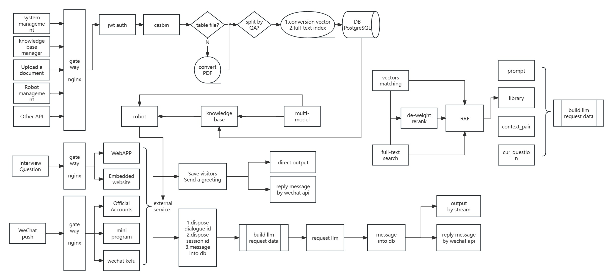

<p align="center"><a href="https://Chatwiki.com/"></a></p>

<h1 align="center">ChatWiki</h1>

<p align="center">
  <a href="./README_en.md">English</a> |
  <a href="./README.md">简体中文</a>  |
   <a href="./UpdateLog.md">Update Log</a>
</p>


ChatWiki is an open-source knowledge base AI question-and-answer system. The system is built upon Large Language
Models (LLM) and Retrieval-Augmented Generation (RAG) technology, offering out-of-the-box capabilities for data
processing and model invocation. It can assist enterprises in rapidly constructing their own knowledge base AI
question-and-answer systems.

### Capabilities

---

**1. Exclusive AI Question-and-Answer System**

By importing existing corporate knowledge to build a knowledge base, AI robots can use the associated knowledge base to
answer questions, rapidly constructing an enterprise-specific AI question-and-answer system.

**2. One-Click Model Integration**

ChatWiki supports more than 20 mainstream models globally. Simply configure the model API key and other information for
successful model integration.

**3. Automatic Data Preprocessing**

ChatWiki offers various data import methods such as automatic segmentation, QA segmentation, manual input, and CSV. It
automatically preprocesses, vectorizes, or QA segments the imported text data.

**4. Simple and User-Friendly Usage**

ChatWiki features an intuitive visual interface design. With straightforward and easy-to-understand steps, users can
effortlessly create AI question-and-answer robots and knowledge bases.

**5. Adaptable to Different Business Scenarios**

ChatWiki provides different channels for AI question-and-answer robots, supporting WebAPP, website embedding, desktop
clients, etc., to meet the diverse usage requirements of different
business scenarios.

### Getting Started

---

Before installing ChatWiki, you need to prepare a **Linux** server with internet connectivity and ensure that the server
meets the minimum system requirements:

- CPU: At least 2 cores

- RAM: At least 4GB

**Installation**

ChatWiki Community Edition is deployed using Docker. Please ensure that Docker is already installed on your server. If
not, you can install it with the following command:

~~~
sudo curl -sSL https://get.docker.com/ | CHANNEL=stable sh
~~~

After installing Docker, follow the steps below to install ChatWiki Community Edition:

**(1). Clone or download the ChatWiki project code**

```shell
git clone https://github.com/zhimaAi/chatwiki.git
```

**(2). Use Docker Compose to build and start the project**

```shell
cd chatwiki/docker
docker compose up -d
```

**Deployment Manual**

If you encounter any problems or have suggestions during the installation and deployment, you
can [contact us](#contact-us) for help, or refer to the following documentation:

- [One-click Deployment of ChatWiki Community Edition](https://www.yuque.com/zhimaxiaoshiwangluo/pggco1/wql8ekkylbwegbzo)
- [How to Configure Model Providers and Supported Models](https://www.yuque.com/zhimaxiaoshiwangluo/pggco1/pn79lkvl53bo0xxm)
- [Local Model Deployment](https://www.yuque.com/zhimaxiaoshiwangluo/pggco1/evmy0rr9gr2gp2i0)
- [How to Configure External Services and Domain Names for Receiving Push Notifications](https://www.yuque.com/zhimaxiaoshiwangluo/pggco1/nfk4slc95s4i8u4v)
- [Docker-Free Deployment of ChatWiki](https://www.yuque.com/zhimaxiaoshiwangluo/pggco1/klriercbhpy97o0g)
- [How to Obtain the Large Model ApiKey](https://www.yuque.com/zhimaxiaoshiwangluo/pggco1/lx3ho90skq95dpdq)

### UI

---

<p align="center">          </p> <p align="center">          </p> <p align="center">          </p>

### Architecture diagram

---



### Technology Stack

------

- Frontend: vue.js
- Backend: golang + python
- Database: PostgreSQL 16 + pgvector + zhparser
- Caching: redis 5.0
- Web Service: nginx
- Asynchronous Queue: nsq
- Process Management: supervisor
- Models: Supports models from OpenAI, Google Gemini, Claude3, Tongyi Qianwen, Wenxin Yiyi, Xunfei Xinghuo, Baichuan,
  Tencent Hunyuan, etc.

<h3>Contact Us <a name="contact-us"></a></h3>

---

We welcome you to contact us for assistance or to provide suggestions to help us improve ChatWiki. You can reach us
through the following methods:

- **WeChat:** Join the ChatWiki Technical Exchange Group by Scanning the WeChat QR Code

  

- **Email:** You can email us at jarvis@2bai.com.cn to get in touch.

### License

---

This repository is governed by
the [ChatWiki Open Source License](https://github.com/zhimaAi/chatwiki/blob/main/LICENSE), which is based on the Apache
License 2.0 but includes some additional restrictions:

1. Commercial use as a backend service is allowed, but it cannot be used in a multi-tenant SAAS mode.
2. Unless you obtain a specific commercial license, you may not remove the copyright information and ChatWiki logo from
   any commercial service pages.

For the complete license, please review
the [ChatWiki Open Source License](https://github.com/zhimaAi/chatwiki/blob/main/LICENSE). If you need to obtain an
additional commercial license, please [contact us](#contact-us). 

