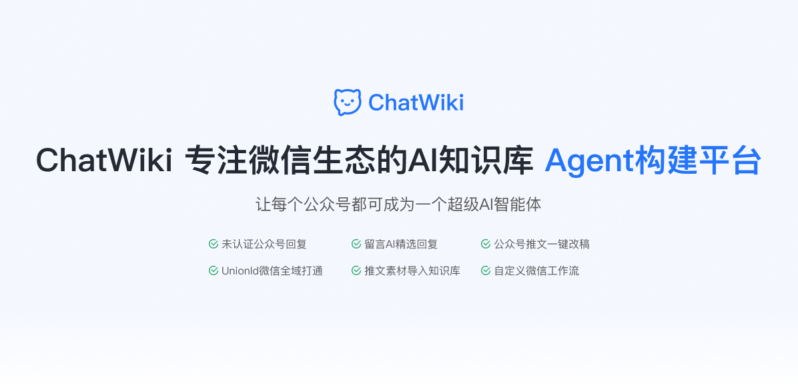
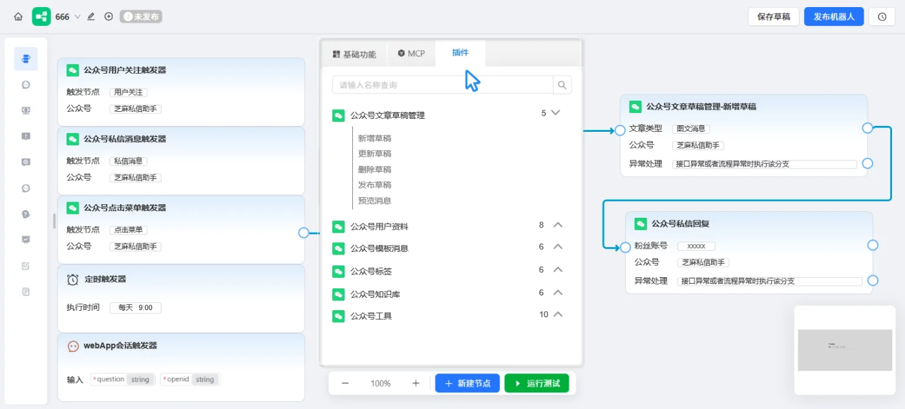
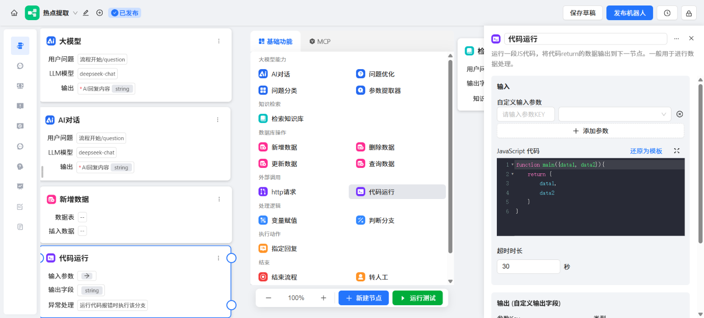
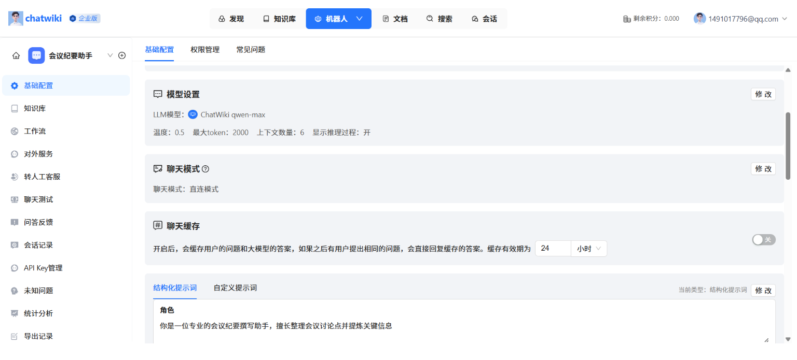
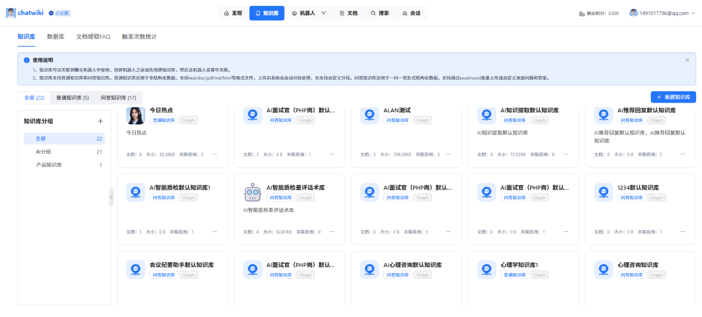
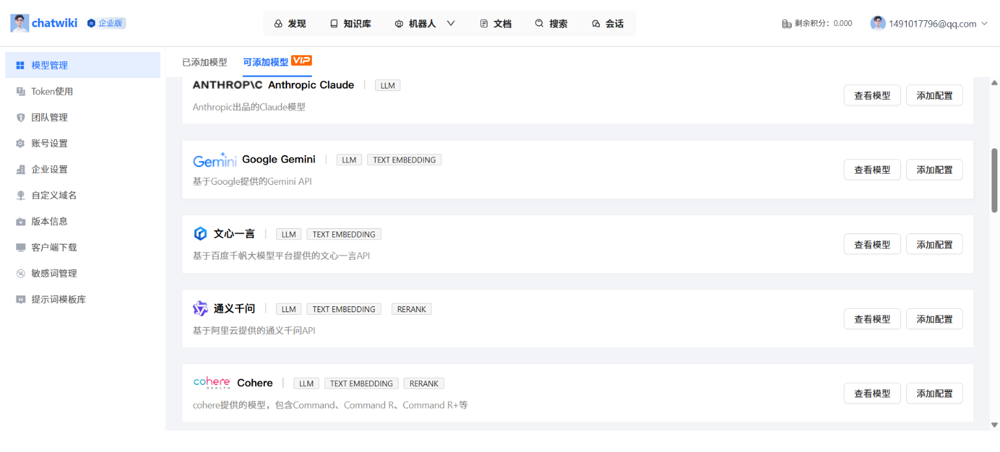
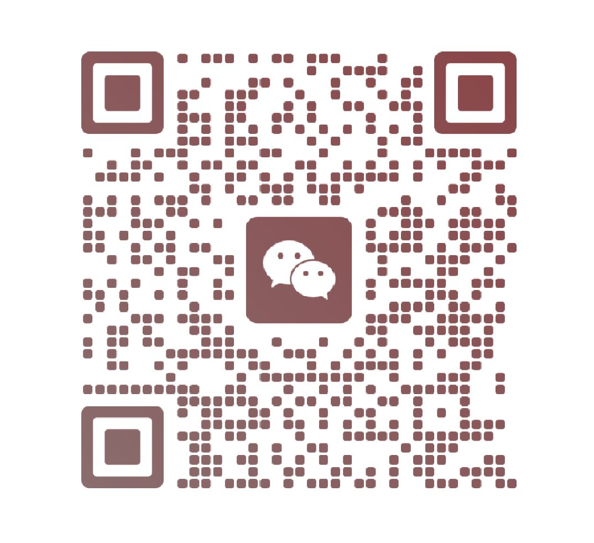

<p align="center"><a href="https://Chatwiki.com/"></a></p>

<p align="center">
  <a href="./README.md">English</a> |
  <a href="./README_zh.md">简体中文</a> |
  <a href="./UpdateLog.md">更新日志</a> |
  <a href="https://www.yuque.com/zhimaxiaoshiwangluo/pggco1/ykeoauc4g9k2dwv1">帮助文档</a>
</p>

## 🎯 产品定位

ChatWiki 是一个专注微信生态的工作流自动化平台，致力于让每个公众号都可成为一个超级AI智能体。全面集成公众号平台的开放能力，拖拽即可搭建微信生态应用，实现公众号推文一键改稿、留言AI精选回复等能力



## ✨ 核心特性

### 💬 微信生态深度集成

- **全行业首创**：未认证公众号私信自动回复，支持文本、语音、图片、小程序卡片、视频消息等。

- **微信工作流**：集成用户私信、留言、关注、取关、点击菜单等触发场景，支持回复私信，粉丝打标签，生成草稿文章、发布文章等多种处理流程

- **知识库同步**：支持抓取公众号文章素材，一键建立知识库。

### 🤖 基础能力

- **工作流编排：** 对话工作流、插件工作流，包含基础的工作流节点、双向 MCP、Agent 模式、用户交互。

- **文档知识库：** 支持 url 读取、文档批量导入、API 对接、支持AI分段、QA分段、父子分段。支持知识图谱、向量混合检索，可视化查看知识图谱。

- **问答知识库：** 上传文档自动抽取问答知识，支持未知问题自动聚类，支持从人工对话中总结常用FAQ

- **转人工客服：** 通过机器人处理一般的用户咨询，同时支持人工客服接待。机器人处理不好的问题可以由人工客服介入处理，支持多客服协同分配。

- **模型支持：** 支持DeepSeek R1、doubao pro、qwen max、Openai、Claude 等全球20多种主流模型。

### 🌐 更多能力

- **多种部署方式**：提供桌面客户端、支持发布为WebApp，支持嵌入网站、公众号服务号、微信客服、微信小店客服等

- **MCP&API集成**：可引入外部MCP服务，或将工作流发布为MCP服务。完整的OpenAPI接口，轻松集成现有业务系统。

- **多账号权限管理**：管理、编辑、查看三级权限体系，实现数据权限隔离。IP白名单、登录日志永久留存。

## 🛸UI

- 🌍**免费体验网址**： [chatwiki.com](https://chatwiki.com/)
- 🖼️**系统截图**：

<p align="center">       </p> 
<p align="center">       </p> 

## 🚀 一键部署

ChatWiki 社区版基于 Docker 部署，只需简单几步即可完成安装：

```
# 安装 Docker
sudo curl -sSL https://get.docker.com/ | CHANNEL=stable sh
# 克隆项目
git clone https://github.com/zhimaAi/chatwiki.git
cd chatwiki/docker
# 启动服务
docker compose up -d
# 开始使用，通过IP+端口访问(需要开放指定的端口${CHAT_SERVICE_PORT},默认18080)
# 默认账号：admin
# 默认密码：chatwiki.com@123
```

在安装和部署中有任何问题或者建议，可以 [联系我们](https://github.com/zhimaAi/chatwiki?tab=readme-ov-file#contact-us)
或者查看 [帮助文档](https://www.yuque.com/zhimaxiaoshiwangluo/pggco1?source=aHR0cHM6Ly9jaGF0d2lraS5jb20v)
获取帮助，也可以参考下面的文档。

- [通过chatwiki安装助手安装](https://www.yuque.com/zhimaxiaoshiwangluo/pggco1/tvwn5npk63aqikq1)

- [一键部署ChatWiki社区版](https://www.yuque.com/zhimaxiaoshiwangluo/pggco1/wql8ekkylbwegbzo)

- [docker镜像站安装+离线安装](https://www.yuque.com/zhimaxiaoshiwangluo/pggco1/aa3htgexhdocyagr)

- [免Docker部署ChatWiki](https://www.yuque.com/zhimaxiaoshiwangluo/pggco1/klriercbhpy97o0g)

- [宝塔Linux面板部署ChatWiki社区版](https://www.yuque.com/zhimaxiaoshiwangluo/pggco1/gefgwdfnclua7d9y)

- [使用1Panel部署ChatWiki社区版](https://www.yuque.com/zhimaxiaoshiwangluo/pggco1/munvto5g1ctc1gcu)

- [如何配置模型供应商及支持的模型](https://www.yuque.com/zhimaxiaoshiwangluo/pggco1/pn79lkvl53bo0xxm)

- [本地模型部署](https://www.yuque.com/zhimaxiaoshiwangluo/pggco1/evmy0rr9gr2gp2i0)

- [如何配置对外服务和接收推送的域名](https://www.yuque.com/zhimaxiaoshiwangluo/pggco1/nfk4slc95s4i8u4v)

- [如何获取大模型ApiKey](https://www.yuque.com/zhimaxiaoshiwangluo/pggco1/lx3ho90skq95dpdq)

## 💻 技术栈

----

- 前端：vue.js

- 后端：golang +python

- 数据库：PostgreSQL16+pgvector+zhparser

<h2>🏡社区交流&联系我们 <a name="contact-us"></a></h2>

----
欢迎联系我们获取帮助，或者提供建议帮助我们改善ChatWiki。您可以通过以下方式联系我们：

- **帮助：** 查看 [帮助文档](https://www.yuque.com/zhimaxiaoshiwangluo/pggco1?source=aHR0cHM6Ly9jaGF0d2lraS5jb20v)
- **邮箱：** 您可以发送邮件到 [jarvis@2bai.com.cn](mailto:jarvis@2bai.com.cn)联系我们。
- **微信：** 使用微信扫码加入ChatWiki技术交流群，添加请备注“chatwiki”

<p align="left"></p>

## 📖**更新日志**

---
查看完整更新日志请点击👉️👉️[UpdateLog.md](./UpdateLog.md)

**2026/03/20**

1.变量填写完直接显示在会话顶部<br/>
2.飞书多维表格-查询记录节点:修复输入数据后,再次选中多维表输入框,查询条件和查询字段会消失<br/>
3.企微机器人回复的图片url补充访问域名<br/>
4.【STD】云版模型服务增加Chatwiki模型服务<br/>

**2026/03/13**

1.chatwiki支持授权chatclaw登陆<br/>
2.知识库:支持上传视频,机器人支持回复视频<br/>
3.机器人/工作流:对外服务支持企微机器人<br/>
4.修复定时触发器发布时参数验证错误问题<br/>
5.工作流发布:发布窗口显示渠道链接<br/>
6.chatclaw客户端token管理、强制下线<br/>

**2026/03/06**

1.多模态内容在会话记录中显示兼容<br/>
2.【STD】国外注册流程，支持google和邮箱注册<br/>
3.公众号文章-手动同步和自动同步<br/>
4.会话日志:会话增加提示词日志<br/>
5.【STD】增加万能邀请码,后续放在沟通群中<br/>
6.普通知识库编辑分段时支持合并上下分段<br/>
7.模型管理:支持接入openrouter模型<br/>
8.核心服务启动优化:移除对neo4j的依赖限制<br/>
9.添加模型/编辑模型弹窗中支持修改api域名<br/>
10.开放接口:增加知识库召回接口<br/>
11.机器人/工作流知识库召回元数据筛选支持引用变量<br/>

## 协议

---

本项目遵循[ChatWiki Open Source License](https://github.com/zhimaAi/chatwiki/blob/main/LICENSE)
开源协议。[ChatWiki Open Source License](https://github.com/zhimaAi/chatwiki/blob/main/LICENSE)基于Apache License
2.0协议，但是有一些额外的限制：

1. ChatWiki 对个人用户免费，包括个人从事的非商业或商业活动。
2. 任何公司、组织、机构或团队若将 ChatWiki 用于商业目的，均须联系我们获得商业授权。
3. 在使用 ChatWiki 的前端组件时，您不得移除或修改其中包含的“ChatWiki”标识、商标或版权声明。

**完整的许可证文本请查看：[LICENSE](./LICENSE) 文件，需要获取商业授权请[联系我们](#contact-us)**

