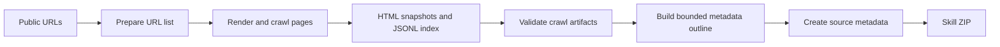

# Web to Skill

Turn a public website or an explicit set of URLs into a searchable, reusable AI skill.

Web to Skill is designed for product documentation, help centers, public knowledge bases, and similar web content. It
discovers site navigation, captures dynamically rendered pages, creates local HTML snapshots and a JSONL retrieval
index, and packages everything as a standalone skill ZIP. The generated skill keeps the source pages as traceable
evidence while providing bounded local retrieval, so an AI agent can fetch only the pages it needs instead of loading an
entire site into context.

## Features

- **Single-entry discovery**: Provide one URL to discover pages from the site's navigation or documentation tree.
- **Explicit batch collection**: Provide multiple URLs to validate, normalize, and deduplicate only those URLs, without
  expanding the requested scope.
- **Dynamic rendering**: Capture JavaScript-rendered pages with Playwright and headless Chromium.
- **Site-specific extraction**: Built-in content selectors for ChatWiki Docs, Yuque, Feishu, OpenClaw Docs, Alibaba
  Cloud Help, KanCloud, and WeChat Official Account articles.
- **Resilient crawling**: Sequential processing, one retry for transient failures, redirect-target deduplication,
  consecutive-timeout stopping, and structured logs.
- **Content cleanup**: Remove scripts and other non-content elements, extract metadata and keywords, and suppress
  high-frequency noise shared across pages.
- **Traceable indexing**: Every index record points to its source URL and saved HTML snapshot.
- **Bounded metadata context**: Sample at most 60 page summaries proportionally across source sites before generating
  skill metadata.
- **Ready-to-use skill packages**: Generate `SKILL.md`, agent configuration, the web index, HTML snapshots, and
  retrieval helpers.

## How It Works



Deterministic scripts handle URL preparation, crawling, crawl validation, metadata outlining, and packaging. Site-level
metadata such as the skill name, description, topic groups, and coverage notes must be produced by an AI agent from the
bounded outline. The build script validates and packages this metadata; it does not invent business information.

## Requirements

- Python 3.10+
- Network access to the target public website
- Playwright, Beautiful Soup, and jieba
- Playwright Chromium

Install the Python dependencies and browser:

```bash
python -m pip install playwright beautifulsoup4 jieba
python -m playwright install chromium
```

> The examples use `python`. Replace it with `python3` if that is the executable name in your environment.

## Quick Start

The examples below assume that the current directory is this `web-to-skill` skill directory and that all intermediate
artifacts are written to `./workspace`.

### 1. Prepare the URL List

Provide one entry URL to discover its documentation directory:

```bash
python scripts/prepare_urls.py \
  --out workspace/crawl/url-list.txt \
  "https://example.com/docs"
```

Alternatively, provide multiple explicit pages. Directory discovery is skipped in this mode:

```bash
python scripts/prepare_urls.py \
  --out workspace/crawl/url-list.txt \
  "https://example.com/docs/start" \
  "https://example.com/docs/configuration"
```

The result is a UTF-8 text file containing one normalized URL per line.

### 2. Crawl the Pages

```bash
python scripts/crawl_urls.py \
  --url-list workspace/crawl/url-list.txt \
  --out-dir workspace/crawl
```

This stage produces:

```text
workspace/crawl/
├── url-list.txt       # Final normalized URL list
├── index.jsonl        # URLs, titles, descriptions, keywords, and snapshot paths
├── crawl.log          # Discovery, progress, retries, failures, and stop reasons
└── html/              # Cleaned rendered HTML snapshots
```

Validate the crawl without exposing the complete log to model context:

```bash
python scripts/validate_crawl.py \
  --index workspace/crawl/index.jsonl
```

The helper resolves crawl-index HTML paths relative to `index.jsonl` and emits only the final crawl counts, a bounded
failure summary, and a bounded redirect-duplicate summary.

Use debug mode to process at most the first five URLs while validating the workflow:

```bash
python scripts/crawl_urls.py \
  --url-list workspace/crawl/url-list.txt \
  --out-dir workspace/crawl-debug \
  --debug
```

The crawler writes the effective URL list into its output directory. In debug mode, this contains at most the first five
URLs, so the same validator can check the isolated debug artifacts:

```bash
python scripts/validate_crawl.py \
  --index workspace/crawl-debug/index.jsonl
```

### 3. Create Skill Metadata

Generate a bounded metadata outline instead of loading the complete index:

```bash
python scripts/metadata_outline.py \
  --index workspace/crawl/index.jsonl
```

The helper returns at most 60 page summaries, allocated proportionally by source site and sampled evenly within each
site. Create `workspace/skill-metadata.json` using only that outline and the contract in
[`references/metadata.md`](references/metadata.md). Keep `coverage_notes` empty unless the sampled metadata explicitly
states a boundary; absence from a bounded outline is not evidence that a topic is unsupported.

### 4. Build the Skill ZIP

```bash
python scripts/build_skill.py \
  --index workspace/crawl/index.jsonl \
  --metadata workspace/skill-metadata.json \
  --zip-out workspace/generate_skill/example-docs.zip
```

The build script also requires `crawl.log` beside `index.jsonl`. It reads the last `crawl_urls run.done` event,
validates its counts against the index, and writes a deterministic success, failure, redirect-duplicate, and
timeout-skipped coverage note into the generated skill. A missing log or a log without `run.done` fails the build.

The generated archive has the following structure:

```text
example-docs/
├── SKILL.md
├── agents/
│   └── openai.yaml
├── references/
│   ├── web-index.jsonl
│   └── html/
│       └── *.html
└── scripts/
    ├── search_index.py
    └── fetch_rendered_html.py
```

The generated `search_index.py` returns a bounded set of candidate pages from the local index. `fetch_rendered_html.py`
refreshes a single page only when the saved snapshot is insufficient or current content is explicitly required.

## Site-Specific Behavior

| Site or content type | Strategy                                                                                                                                     |
|----------------------|----------------------------------------------------------------------------------------------------------------------------------------------|
| Generic public pages | Discover links from rendered navigation and fall back to the rendered page body                                                              |
| ChatWiki Docs        | Use the Docusaurus sitemap and retain the language selected by the entry URL                                                                 |
| KanCloud             | Read the full directory tree from `application/payload+json`; fail rather than silently continue when a known directory yields only one page |
| Yuque                | Use a longer navigation timeout during directory discovery                                                                                   |
| Feishu               | Keep the longest stable body snapshot if the final rendered body becomes empty or shorter                                                    |
| Other adapted sites  | Use built-in body selectors and fall back to the rendered page body when necessary                                                           |

## Reliability and Scope

- Only public `http://` and `https://` pages are supported. The project does not handle authentication, CAPTCHAs, or
  access-control bypasses.
- URLs are crawled sequentially. A timed-out page is retried once; crawling stops after four consecutive final timeouts.
- Prepared URLs that redirect to the same final page produce one index record. Redirect aliases are reported separately
  in crawl coverage instead of being counted as failures.
- HTTP 429 and 5xx responses, browser network errors, timeouts, and empty rendered bodies enter the retry path.
- URL preparation and crawling use fixed workflow policies. Concurrency, depth, link scope, timeout, and retry counts
  are intentionally not exposed as command-line controls.
- HTML snapshots represent the page state at crawl time. Re-run the crawler, or use the generated single-page refresh
  helper, when current content is required.
- Before crawling, make sure your use complies with the target site's terms of service, robots policies, and content
  permissions.

## Project Structure

```text
.
|-- README.md
|-- SKILL.md                    # Agent workflow
|-- agents/openai.yaml          # Skill presentation and default prompt
|-- references/metadata.md      # Model-authored metadata schema and limits
`-- scripts/
    |-- prepare_urls.py         # URL validation, normalization, and discovery
    |-- crawl_urls.py           # Sequential crawling, cleanup, indexing, and logs
    |-- validate_crawl.py       # Relative-path checks and bounded crawl summary
    |-- metadata_outline.py     # Bounded proportional metadata sampling
    |-- build_skill.py          # Metadata validation and ZIP packaging
    |-- search_index.py         # Bounded local retrieval for generated skills
    `-- fetch_rendered_html.py  # Playwright rendering and single-page refresh
```

## Design Principles

- **Traceable facts**: Retrieved information remains connected to a source URL and saved HTML snapshot.
- **Controlled scope**: Single-entry discovery and explicit URL batches use separate strategies to prevent accidental
  crawl expansion.
- **Bounded context**: Metadata generation uses a source-proportional outline, while the generated JSONL index supports
  search-first, read-later access instead of loading the entire site into an agent context.
- **Portable output**: Each final ZIP includes its index, snapshots, and runtime helpers, making it suitable for
  independent distribution and installation.
