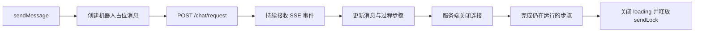
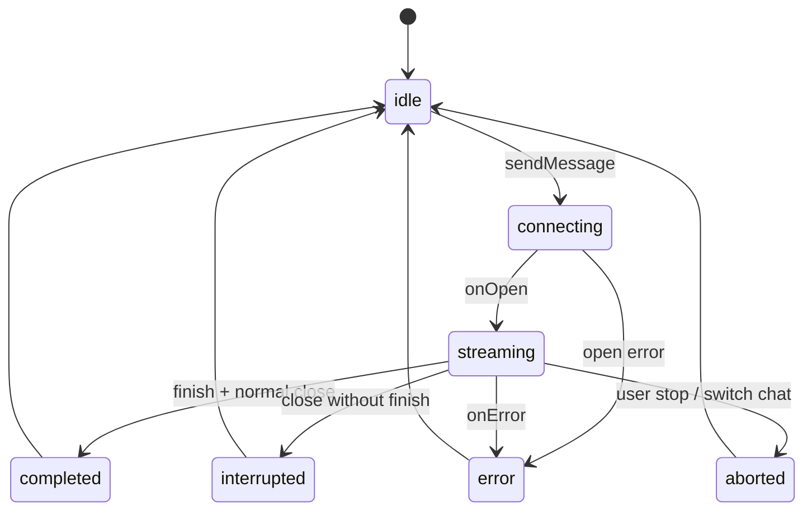
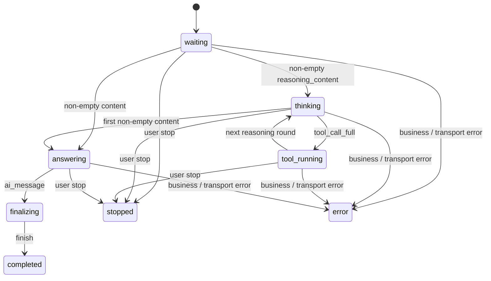

# Clawbot Chat 模块说明

> 文档定位：同时记录当前前端实现（As-Is）与建议的生产级协议目标（To-Be）。标记为“目标”的内容属于架构约束或待办，不代表代码已经实现。

| 项目 | 内容 |
| --- | --- |
| 适用范围 | Clawbot Chat 前端模块及 `/chat/request` SSE 协议 |
| 当前协议版本 | 未显式版本化，按隐式 `v0` 管理 |
| 当前实现依据 | `clawbot-chat.js`、SSE 封装及实际事件流 |
| 成功收尾现状 | `finish`、用户停止和 `onClose` 进入同一幂等过程收尾入口 |
| 文档更新时间 | 2026-07-21 |

文档使用以下标记：

- **现状**：当前代码已经实现，可以作为排查依据。
- **目标**：建议前后端共同遵守的正式协议或改进方向。
- **风险**：当前实现与生产级目标之间的差距。

## 模块职责

Clawbot Chat 负责会话初始化、消息发送、SSE 流式事件消费，以及机器人消息的过程时间线和最终正文展示。

主要文件：

- `src/api/chat/index.js`：创建 `/chat/request` SSE 请求。
- `src/utils/http/sse/index.js`：封装 SSE 连接、消息转发、关闭和异常处理。
- `src/stores/modules/clawbot-chat.js`：维护会话与消息状态，消费业务事件。
- `src/views/clawbot/chat/components/messages/robot-message-item.vue`：组合知识库进度、思考过程和最终答案。
- `src/views/clawbot/chat/components/messages/process-timeline.vue`：展示思考、技能和工具步骤。
- `src/views/clawbot/chat/components/messages/final-answer-card.vue`：展示最终正文。

## 架构边界与职责

| 层级 | 职责 | 不应承担的职责 |
| --- | --- | --- |
| 服务端 `/chat/request` | 生成业务事件、保证事件契约和顺序、给出业务完成信号 | 不依赖前端通过空字段猜测完成状态 |
| SSE 传输层 | 建立连接、解析标准 SSE 帧、转发消息、处理连接关闭与网络异常 | 不解释 `stream_message`、`tool_result` 等业务语义 |
| `clawbot-chat` Store | 将原始事件规范化，并统一更新消息、轮次和步骤状态 | 不直接渲染 Markdown 或控制具体图标 |
| 消息组件 | 根据 Store 状态展示加载、思考、工具和正文 | 不重复解析 SSE 原始事件 |

当前数据流如下：

```text
旧版/新版 SSE
      ↓ normalizeSseEvent
NormalizedChatEvent
      ↓ applyNormalizedChatEvent
process_steps + content
      ↓
ProcessTimeline + 最终正文
```

状态的单一责任如下：

- 连接是否存活由连接状态负责。
- 整条消息是否完成由消息状态负责。
- 当前轮是否仍在思考由活动思考步骤负责。
- 工具是否完成由对应 `tool_call_id` 的步骤状态负责。
- 思考、工具和技能的过程状态只由 `process_steps` 表达。
- `reasoning_content` 仅保留为接口和旧历史数据兼容字段，不直接驱动 UI。

## SSE 连接逻辑

### 建立连接

`sendMessage` 会先检查 `sendLock`，同一时间只允许一条消息处于发送状态。随后创建机器人占位消息，并通过 `sendAiMessage` 向 `/chat/request` 发起 `POST` SSE 请求。

请求体使用 `FormData`，当前包含：

| 参数 | 说明 |
| --- | --- |
| `robot_key` | 当前机器人标识 |
| `openid` | 当前访客标识 |
| `question` | 用户发送的消息 |
| `form_ids` | 当前机器人配置的表单 ID |
| `dialogue_id` | 当前对话 ID，新对话为 `0` |
| `global` | 调用方传入的全局参数 |
| `chat_prompt_variables` | 仅新对话存在本地暂存变量时携带 |
| `debug` | 开发环境固定传入 `0` |

SSE 传输层设置 `openWhenHidden: true`，页面隐藏后仍继续接收消息。连接成功要求 HTTP 状态正常且响应类型为 `text/event-stream`。

### 事件帧格式

服务端按标准 SSE 帧发送事件，一条事件由 `event`、`data` 和结尾空行组成：

```text
event:stream_message
data:{"role":"assistant","content":"您好"}

```

传输层解析后向 Store 传递 `{ event, data }`。其中 `event` 用于选择业务分支，`data` 保持字符串形式；需要结构化数据的分支再通过 `safeParseJson` 解析。连续出现多个同名事件表示多个独立增量帧，不代表同一事件尚未结束。

### 防止旧连接串流

每次发送都会递增 `sseRequestSeq` 并保存本次请求序号。事件回调和关闭回调只有在序号仍与当前值一致时才生效。

切换对话、重新创建对话或手动停止时，`abortCurrentSSE` 会先递增序号，再中断旧连接。因此旧连接即使延迟返回事件，也不会写入当前会话。

### 连接生命周期



连接正常关闭时，Store 会：

1. 调用 `finalize_process_steps`，完成仍处于 `running` 的过程步骤。
2. 删除没有任何思考内容的空思考步骤。
3. 清空 `active_thinking_step_id`。
4. 关闭机器人消息的 `loading`。
5. 释放 `sendLock` 并清空当前 SSE 实例。

传输层 `onerror` 与业务事件 `event:error` 不是同一个概念。传输层异常由 SSE 封装记录、终止连接并继续抛出；当前聊天 Store 没有注册额外的 `onError` 回调。

## 机器人消息状态

每条机器人消息通过以下字段记录生成状态：

| 字段 | 初始值 | 说明 |
| --- | --- | --- |
| `content` | `''` | 已累计的正文内容 |
| `reasoning_content` | `''` | 接口兼容字段；实时展示不直接读取该字段 |
| `startLoading` | `true` | 是否仍在等待正文开始 |
| `loading` | `true` | 整条机器人消息是否仍在生成 |
| `process_steps` | `[]` | 思考、技能、工具和操作步骤 |
| `process_expanded` | `true` | 过程时间线的初始展开值；组件挂载后由本地状态管理 |
| `current_round_index` | `0` | 当前模型轮次序号 |
| `active_thinking_step_id` | `''` | 当前正在运行的思考步骤 ID |
| `quote_loading` | `false` | 是否正在检索知识库引用 |
| `is_stopped` | `false` | 是否被用户手动停止 |

过程步骤的主要字段：

| 字段 | 说明 |
| --- | --- |
| `type` | `thinking`、`skill`、`tool` 或 `operation` |
| `status` | `running` 表示执行中，`done` 表示已完成 |
| `roundIndex` | 步骤所属模型轮次 |
| `contentText` | 思考增量累计内容 |
| `paramsText` | 工具输入参数 |
| `resultText` | 工具输出或步骤结果 |
| `tool_call_id` | 工具调用与结果的关联 ID |
| `hidden` | 是否从过程时间线隐藏 |

## 当前处理的 SSE 事件

| 事件 | `data` 形式 | 当前处理逻辑 |
| --- | --- | --- |
| `dialogue_id` | ID 字符串 | 更新当前 `dialogue_id` |
| `c_message` | 用户消息 JSON | 解析、补充前端展示字段并加入消息列表 |
| `robot` | 机器人事件数据 | 将预先创建的机器人占位消息加入列表；新对话同时插入会话列表；当前分支不读取其 `data` |
| `reply_content_list` | JSON 字符串 | 解析并保存推荐回复列表 |
| `reasoning_content` | 思考文本 | 旧协议思考增量，转换为 `thinking_delta` |
| `sending` | 正文文本 | 旧协议正文增量，转换为 `answer_delta` |
| `llm_rounds` | `begin` 或 `finish` | 转换为轮次开始或结束事件 |
| `stream_message` | 消息增量 JSON | 分别转换思考和正文增量，详见下一节 |
| `tool_call_full` | 工具调用 JSON | 转换为工具或技能开始事件 |
| `tool_result` | 工具结果 JSON | 转换为工具或技能完成事件 |
| `FileOperation` | 操作数据 | 转换为隐藏的操作步骤，前端不执行其内容 |
| `ExecuteCommand` | 操作数据 | 转换为隐藏的操作步骤，前端不执行其内容 |
| `start_quote_file` | 任意数据 | 开启知识库引用加载状态 |
| `quote_file` | 引用数组 JSON | 保存引用列表、展开引用区域并关闭引用加载状态 |
| `ai_message` | 最终消息 JSON | 转换为最终快照，覆盖正文并补充消息 ID、菜单、引用、推荐回复和语音信息 |
| `finish` | 完成数据 | 转换为过程收尾事件，完成仍在运行的步骤并关闭 loading |
| `debug` | 调试数组 JSON | 保存调试信息 |
| `error` | 错误内容 | 保存业务错误信息；它不是 SSE 连接异常回调 |
| `recall_time` | 时间值 | 保存知识召回耗时 |
| `request_time` | 时间值 | 保存整次请求耗时 |
| `chat_prompt_variables` | 变量状态 JSON | 更新待填写变量、会话 ID 和对话 ID |

`robot` 事件需要先于依赖机器人占位消息的增量事件到达。若消息尚未加入 `messageList`，`updateAiMessage` 找不到对应 `uid`，本次更新会直接返回。

### 内部统一事件

`normalizeSseEvent` 只负责协议适配，`applyNormalizedChatEvent` 是过程状态的唯一更新入口。后端根据 `application_type` 选择旧协议或新协议，正常情况下两套增量事件互斥，前端不增加协议模式字段。

| 原始事件 | `NormalizedChatEvent` | 状态职责 |
| --- | --- | --- |
| `reasoning_content` | `thinking_delta` | 旧协议思考增量 |
| `stream_message.reasoning_content` | `thinking_delta` | 新协议思考增量 |
| `sending` | `answer_delta` | 旧协议正文增量 |
| `stream_message.content` | `answer_delta` | 新协议正文增量 |
| `llm_rounds:begin` | `round_begin` | 当前轮次递增一次 |
| `llm_rounds:finish` | `round_finish` | 完成活动思考步骤 |
| `tool_call_full` | `tool_start` | 创建工具或技能步骤 |
| `tool_result` | `tool_finish` | 关联并完成工具或技能步骤 |
| `FileOperation`、`ExecuteCommand` | `operation` | 记录隐藏操作步骤 |
| `finish` | `process_finalize/finish` | 正常完成过程收尾 |
| 用户停止 | `process_finalize/stop` | 停止过程收尾 |
| SSE `onClose` | `process_finalize/close` | 断流兜底收尾 |
| `ai_message` | `final_snapshot` | 应用服务端最终权威快照 |

`error`、`debug`、耗时、知识库引用、推荐回复和会话变量是管理端附属状态，不进入过程状态机，仍由各自分支处理。

## `stream_message` 完整逻辑

`stream_message.data` 是 JSON 字符串，常见字段如下：

```json
{
  "role": "assistant",
  "content": "",
  "reasoning_content": "正在分析问题",
  "extra": {
    "_eino_msg_id": "message-id"
  }
}
```

当前协议约定 `content` 和 `reasoning_content` 不会同时携带非空内容。实现中仍分别判断两个字段；如果异常情况下两者同时非空，会先累计思考内容，再立即完成该思考步骤并累计正文。

### 收到非空 `reasoning_content`

1. 转换为 `thinking_delta` 并根据 `active_thinking_step_id` 查找活动思考步骤。
2. 如果不存在活动步骤，创建 `type: thinking`、`status: running` 的默认收起步骤，并保存其 ID。
3. 旧链路没有 `llm_rounds:begin` 时，首个思考至少归入第 1 轮；新链路轮次只由 `round_begin` 递增。
4. 将增量追加到步骤的 `contentText`；同时累计 `reasoning_content` 仅用于接口兼容。

### 收到非空 `content`

1. 转换为 `answer_delta` 并设置 `startLoading = false`，正文开始展示。
2. 调用 `finishActiveThinkingStep`：
   - 有内容的活动思考步骤更新为 `done`，UI 立即显示完成勾。
   - 没有内容的空思考步骤从时间线删除。
   - 清空 `active_thinking_step_id`。
3. 将正文增量追加到消息的 `content`。
4. 从累计正文提取语音标记到 `voice_content`，并移除正文里的语音格式标记。

后续正文分片仍会调用同一个完成函数，但因为活动思考步骤 ID 已经清空，不会重复修改已完成步骤。

### 收到空字段或元数据帧

以下帧不会切换思考或正文状态：

```json
{"role":"assistant","content":""}
```

```json
{"role":"assistant","content":"","extra":{"_eino_msg_id":"message-id"}}
```

只有非空 `reasoning_content` 才进入思考状态，只有非空 `content` 才完成当前轮思考并开始累计正文。

## 模型轮次、工具与正文的关系

典型事件顺序如下：

```text
llm_rounds: begin
  stream_message: reasoning_content 增量
  tool_call_full
  tool_result
llm_rounds: finish

llm_rounds: begin
  stream_message: reasoning_content 增量
  stream_message: 首个非空 content
  stream_message: 后续 content 增量
llm_rounds: finish

ai_message
服务端关闭 SSE
```

具体规则：

- `llm_rounds: begin` 会递增 `current_round_index`。
- 轮次只在 `llm_rounds: begin` 递增；旧链路缺少轮次事件时，首个思考兼容初始化为第 1 轮，不会在创建步骤时重复递增。
- `tool_call_full` 根据当前轮次创建工具步骤。普通工具保存输入参数；函数名为 `skill` 时创建技能步骤，并使用参数中的技能名作为标题。
- `tool_result` 优先按 `tool_call_id` 精确关联。缺少 ID 时，兼容匹配最近的运行步骤和工具名；仍无法关联则安全忽略，避免误完成其他并行工具。
- 首个非空正文会立即完成当前活动思考步骤。
- `llm_rounds: finish` 是轮次级兜底；正文已经完成思考步骤时不会重复处理。
- `ai_message` 是服务端持久化后的最终消息，会覆盖流式累计正文，确保最终展示与服务端记录一致。

## 当前不消费的事件

实际 SSE 日志还可能出现以下事件，但 `clawbot-chat` 当前没有对应业务分支：

| 事件 | 当前表现 |
| --- | --- |
| `ping` | 作为心跳事件忽略 |
| `keep-alive` | 作为保活事件忽略 |
| `session_id` | 当前 Store 不直接更新；变量流程可通过 `chat_prompt_variables` 更新会话 ID |
| `customer` | 当前 Store 不直接消费，用户信息主要来自会话初始化和 `c_message` |
| `data` | 当前 Store 不消费该最终数据快照 |

空正文帧不能作为思考完成或整条消息结束信号。`finish` 会主动收尾过程步骤；`onClose` 仍作为幂等兜底并负责释放连接资源。

## 手动停止

用户停止生成时，Store 会：

1. 找到最近一条仍在生成的机器人消息。
2. 设置 `is_stopped = true`，关闭消息、正文等待和引用加载状态。
3. 派发 `process_finalize/stop`，完成或清理仍在运行的过程步骤。
4. 中断 SSE，并通过请求序号使旧连接的后续回调失效。
5. 释放 `sendLock`。

## UI 状态映射

### 历史消息转换

历史消息进入列表前先调用 `normalizeHistoricalProcessSteps`：

- `process_steps` 同时兼容数组和 JSON 字符串。
- 已有步骤时直接使用，不重复生成。
- 仅机器人文本消息（`is_customer != 1 && msg_type == 1`）参与旧思考转换。
- 没有步骤且 `reasoning_content` 非空时，生成一个 `thinking/done` 步骤。
- 兼容步骤 ID 使用 `legacy-thinking-${message_id || id || uid}`，保证分页或重新进入会话时结果确定。
- 用户消息、菜单、图片和空思考不会生成过程步骤。

原始 `reasoning_content` 可以继续保留在消息中，但机器人消息组件不再直接读取它。

### 时间线渲染

`process-timeline.vue` 根据步骤的 `status` 渲染状态图标：

- `running`：显示加载图标。
- `done`：显示完成勾。

时间线标题会检查当前可见步骤中是否仍存在 `running` 状态：存在时显示“思考中”，全部完成后显示“思考完成”。

时间线整体和单个步骤的展开状态属于纯展示状态，由 `process-timeline.vue` 在组件本地维护。消息与步骤中的 `process_expanded`、`expanded` 只提供初始值，组件不会回写嵌套 prop。

思考步骤默认收起，生成过程中和完成后都只展示摘要；用户可以随时手动展开或再次收起。用户操作后以本地交互状态为准，时间线标题和完成勾始终保持可见。

“答案生成中提示语”与过程时间线共用同一个运行态标题，不再单独渲染提示语 `thinking-label-wrapper`：

- 配置开关已开启且文案非空时，时间线运行态标题显示配置文案。
- 配置未开启或文案为空时，运行态标题显示“思考中”。
- 配置读取优先使用当前语言配置；字段缺失或文案为空时回退机器人顶层配置，语言级显式关闭仍然优先。
- 多语言配置同时兼容数组和 JSON 字符串，开关同时兼容布尔值 `true` 和字符串 `'true'`。
- 尚未产生思考或工具步骤且没有可见的知识库检索进度时，时间线标题显示唯一的 loading。
- 出现运行中的思考、工具或技能步骤后，loading 由对应步骤展示，标题不再重复显示 loading。
- 知识库检索 loading 可见时由检索提示负责展示，时间线标题不重复显示 loading。
- 等待生成时不再显示头像 loading 或底部点状 loading，过程区域始终只有一个 loading。
- 知识库检索提示保留；检索 loading 可见时，时间线标题不重复显示 loading。

`robot-message-item.vue` 不再渲染旧 `thinking-content` 或消息级思考标题。可见 `process_steps` 与等待正文状态统一进入 `ProcessTimeline`；菜单、图片、引用、回复列表、语音和最终答案仍沿用原组件分支。

## 架构状态模型

### 连接状态

当前代码使用 `mySSE`、`sendLock` 和请求序号间接表达连接状态。目标协议建议显式建模：



**现状**：Store 没有保存显式连接状态，也没有注册 `onOpen`、`onError`；主要依赖 `onClose` 关闭加载状态并释放发送锁。

**目标**：连接关闭只代表传输结束，不能独立证明业务成功。业务成功、异常中断和用户取消必须是不同终态。

### 消息状态



工具执行与思考可能多轮交替，`tool_running` 表示过程状态，不代表整条消息不能继续进入下一轮思考。

### 状态不变量

目标实现应始终满足：

1. 同一条消息最多只有一个 `active_thinking_step_id`。
2. `active_thinking_step_id` 非空时，对应步骤必须存在且状态为 `running`。
3. 首个非空正文到达后，上一活动思考步骤必须立即变为 `done`。
4. 已进入 `completed`、`stopped` 或 `error` 的消息不得继续追加增量。
5. 同一 `tool_call_id` 最多对应一个工具或技能步骤。
6. 所有终态都必须释放发送锁并停止加载动画。
7. 空 `content`、空 `reasoning_content` 和纯元数据帧不得改变消息阶段。

## 关键事件字段契约

本节描述当前前端实际依赖的最小字段。未列出的字段可以透传，但不应改变既有字段语义。

### `stream_message`

| 字段 | 类型 | 前端要求 | 说明 |
| --- | --- | --- | --- |
| `role` | `string` | 可选 | 当前前端不参与状态判断 |
| `content` | `string` | 可选，默认空字符串 | 正文增量 |
| `reasoning_content` | `string` | 可选，默认空字符串 | 思考增量 |
| `extra` | `object` | 可选 | 元数据，当前前端不消费 |
| `extra._eino_msg_id` | `string` | 可选 | 模型消息标识，当前前端不消费 |

协议约束：

- `content` 和 `reasoning_content` 在正常协议中最多一个为非空。
- 两者同时为空时视为元数据帧或空帧。
- 字段内容是增量而不是完整快照，重复消费会造成重复文本。
- 同一模型轮次中，进入非空正文阶段后不应再次发送非空思考增量。

### `llm_rounds`

`data` 必须是 `begin` 或 `finish`。

| 值 | 含义 | 约束 |
| --- | --- | --- |
| `begin` | 一个模型轮次开始 | 应先于该轮的思考、工具或正文事件 |
| `finish` | 一个模型轮次结束 | 必须与尚未结束的最近一次 `begin` 配对 |

**现状**：轮次只在 `llm_rounds:begin` 递增。旧协议没有轮次事件时，首个思考增量仅将轮次初始化为 `1`，创建步骤本身不会再次递增。正式协议仍建议由服务端提供 `round_id`，避免前端依赖事件顺序推算。

### `tool_call_full`

```json
{
  "id": "tool-call-id",
  "function": {
    "name": "tool-name",
    "arguments": "{\"key\":\"value\"}"
  }
}
```

| 字段 | 类型 | 前端要求 | 说明 |
| --- | --- | --- | --- |
| `id` | `string` | 必填 | 工具步骤关联 ID |
| `function.name` | `string` | 必填 | 工具名；值为 `skill` 时按技能步骤展示 |
| `function.arguments` | `string` | 可选 | JSON 字符串；普通工具作为输入展示 |
| `function.arguments.skill` | `string` | 技能调用时必填 | 技能步骤标题 |

### `tool_result`

```json
{
  "tool_call_id": "tool-call-id",
  "content": "工具输出"
}
```

`tool_call_id` 应与先前 `tool_call_full.id` 一致。当前实现优先按 ID 精确关联；旧数据缺少 ID 时可按最近运行步骤和工具名兼容查找，仍找不到时忽略该结果。

### `ai_message`

| 字段 | 类型 | 前端要求 | 说明 |
| --- | --- | --- | --- |
| `id` | `string \| number` | 必填 | 服务端持久化消息 ID |
| `content` | `string` | 必填 | 服务端最终正文快照，会覆盖流式累计正文 |
| `msg_type` | `number` | 可选 | 菜单类消息判断依据 |
| `menu_json` | `string` | 菜单类消息可选 | 菜单问题 JSON |
| `reply_content_list` | `string` | 可选 | 推荐回复列表 JSON |
| `quote_file` | `string` | 可选 | 引用文件列表 JSON |

### 目标协议元数据

当前协议没有显式版本和全局顺序号。建议下一协议版本为每个业务事件提供：

| 字段 | 用途 |
| --- | --- |
| `protocol_version` | 协议兼容和灰度判断 |
| `request_id` | 关联一次 SSE 请求及相关日志 |
| `dialogue_id` | 关联对话 |
| `message_id` | 关联机器人消息 |
| `round_id` | 关联模型轮次，避免由前端推算 |
| `sequence` | 请求内单调递增序号，用于去重和乱序检测 |
| `timestamp` | 事件生成时间，用于耗时分析 |

这些字段应由服务端生成，前端不能通过正文内容或到达时间推断。

## 事件顺序与次数约束

| 事件 | 建议次数 | 顺序约束 |
| --- | --- | --- |
| `dialogue_id` | `0..1` | 新对话时应在需要该 ID 的业务事件前发送 |
| `c_message` | `1` | 每次用户请求一次 |
| `robot` | `1` | 必须先于所有需要更新机器人占位消息的事件 |
| `llm_rounds:begin` | `0..N` | 与同轮 `finish` 配对 |
| `stream_message` | `0..N` | 同一轮中思考增量应先于正文增量 |
| `tool_call_full` | `0..N` | 必须先于相同 ID 的 `tool_result` |
| `tool_result` | `0..N` | 必须引用已经出现的 `tool_call_id` |
| `ai_message` | `0..1`，目标为 `1` | 应晚于所有正文增量 |
| `finish` | 逻辑上 `1` | 应是最后一个业务事件；重复帧必须可幂等处理 |
| `ping` / `keep-alive` | `0..N` | 可以出现在任意业务阶段，不改变消息状态 |

**现状**：前端依赖 `robot` 先到；早于 `robot` 的消息更新会因找不到 `uid` 被丢弃，没有缓冲或补偿机制。

**目标**：由服务端保证顺序，或由前端按 `request_id + sequence` 暂存和重排。两种方案必须二选一并形成正式契约。

## 完成语义

完成需要区分三个概念：

| 概念 | 含义 | 当前信号 |
| --- | --- | --- |
| 思考完成 | 当前模型轮次从思考进入正文 | 首个非空 `content`，`llm_rounds:finish` 兜底 |
| 业务完成 | 服务端已生成并保存最终消息 | `finish` 会收尾过程步骤，但 Store 尚未建立显式成功状态 |
| 传输完成 | SSE 字节流已经关闭 | `onClose` |

### 当前行为

- `event:finish` 会派发 `process_finalize/finish`，完成运行步骤并关闭消息 loading。
- `onClose` 会再次执行幂等收尾，并释放发送锁和 SSE 实例。
- 用户停止使用同一收尾函数，但额外设置 `is_stopped` 并主动中断连接。
- 当前仍未用显式消息状态区分成功完成和提前断流。
- 传输异常由 SSE 封装的 `onerror` 处理，Store 没有对应异常终态。

### 目标行为

1. 收到成功 `finish` 后，将消息标记为 `completed`，并记录业务完成时间。
2. `onClose` 只负责释放连接资源。
3. 未收到成功 `finish` 就关闭连接，应进入 `interrupted` 或 `error`，不能显示为正常完成。
4. 用户主动终止进入 `stopped`，与网络异常分开。
5. 重复 `finish` 必须幂等；只能执行一次最终状态转换。
6. `ai_message` 应在成功 `finish` 前到达；缺失时应记录协议异常，并决定保留流式正文还是重新拉取消息。

建议未来版本将 `finish.data` 从单一时间值升级为结构化结果，同时保留旧格式兼容：

```json
{
  "status": "completed",
  "request_id": "request-id",
  "message_id": "message-id",
  "finished_at": 1784596908
}
```

## 幂等、重复与重连

### 当前事件幂等性

| 事件 | 当前是否幂等 | 原因 |
| --- | --- | --- |
| `dialogue_id` | 是 | 相同值重复覆盖 |
| `c_message` | 否 | 每次都会新增一条用户消息 |
| `stream_message` | 否 | 正文和思考内容按增量追加 |
| `tool_call_full` | 否 | 每次都会创建新步骤 |
| `tool_result` | 基本是 | 首次完成后步骤不再是 `running`，重复结果无法再次匹配 |
| `quote_file` | 是 | 使用最新数组覆盖 |
| `ai_message` | 基本是 | 使用最终快照覆盖正文和相关字段 |
| `FileOperation` / `ExecuteCommand` | 否 | 每次都会新增隐藏步骤 |
| `finish` | 是 | 重复执行统一收尾不会重复追加内容或步骤 |

### 目标去重规则

- 每个业务事件使用 `request_id + sequence` 作为唯一键。
- `stream_message` 只有在 `sequence` 大于已消费序号时才追加。
- `c_message`、`ai_message` 使用服务端消息 ID 去重。
- 工具步骤使用 `tool_call_id` 去重。
- `finish` 使用 `request_id` 幂等完成。
- 检测到序号缺口时记录告警；不要静默拼接可能不完整的正文。

### 重连策略

**现状**：SSE 异常时封装会中止连接并抛出异常，没有业务级自动重连、`Last-Event-ID` 或断点续传。

**目标**：只有服务端支持事件缓存、序号和可恢复游标时才能自动重连。否则自动重连可能重复执行模型或工具调用，应提供“重新发送问题”而不是盲目续传。

## 异常模型与恢复策略

业务错误、协议错误和传输错误必须分层处理：

| 异常类型 | 示例 | 当前行为 | 目标行为 |
| --- | --- | --- | --- |
| 建连失败 | 非 2xx、响应类型不是 `text/event-stream` | SSE 封装抛错并中止 | 消息进入 `error`，释放锁并显示可重试提示 |
| 传输中断 | 断网、代理超时、服务端异常断开 | `onerror` 中止，Store 无额外收尾 | 保留已生成内容，标记 `interrupted`，允许安全重试 |
| 业务错误事件 | `event:error` | 保存到 `currentMessage.error` | 定义错误码、用户文案、是否终止生成 |
| JSON 解析失败 | 非法 `stream_message` 或工具数据 | `safeParseJson` 静默返回默认值 | 记录协议错误、事件名和请求 ID，达到阈值后终止 |
| 事件乱序 | `tool_result` 早于 `tool_call_full` | 工具结果被忽略 | 缓冲、重排或明确报协议错误 |
| 占位消息未建立 | 增量早于 `robot` | 更新被直接丢弃 | 服务端保证顺序或前端暂存早到事件 |
| 最终快照缺失 | 没有 `ai_message` | 流式正文仍可能保留 | 标记不完整，按消息 ID重新拉取或提示重试 |
| 提前关闭 | 未收到成功 `finish` 即 `onClose` | 按正常关闭收尾 | 进入 `interrupted`，不能显示成功完成 |
| 用户停止 | 点击停止、切换会话 | 完成步骤并中止连接 | 保持 `stopped` 终态，不自动重连 |

所有异常路径都应执行统一资源收尾：

```text
停止接收事件
→ 完成或失败化运行中步骤
→ 关闭 loading / startLoading / quote_loading
→ 释放 sendLock
→ 清理 SSE 实例
→ 记录终态和错误原因
```

错误对象建议至少包含：

```json
{
  "code": "SSE_CONNECTION_INTERRUPTED",
  "message": "连接已中断",
  "retryable": true,
  "request_id": "request-id",
  "phase": "answering"
}
```

## 最终数据与持久化对账

`stream_message.content` 是实时增量，`ai_message.content` 是服务端持久化后的最终快照。两者的职责必须明确：

- 流式增量用于即时展示，不作为最终持久化事实来源。
- `ai_message` 正常到达时，以服务端快照覆盖流式累计结果。
- 覆盖前可以比较长度或摘要；不一致时记录观测事件，但不阻断正常展示。
- `ai_message` 缺失且连接异常时，保留已生成内容并标记为不完整。
- 重新进入历史会话时，以 `/chat/message` 返回的数据为准，不恢复运行时步骤状态。
- `reasoning_content`、工具过程和调试数据是否持久化，必须由产品安全策略单独决定。

建议定义以下对账结果：

| 结果 | 条件 | UI 行为 |
| --- | --- | --- |
| `consistent` | 流式正文与最终快照一致 | 正常完成 |
| `reconciled` | 内容不同但已用最终快照覆盖 | 正常完成并记录指标 |
| `stream_only` | 缺少最终快照 | 保留内容并标记不完整 |
| `persisted_only` | 无正文增量但收到最终快照 | 直接展示最终正文 |

## 协议兼容与演进

当前模块同时支持两套增量形式：

```text
独立事件：reasoning_content / sending
统一事件：stream_message.reasoning_content / stream_message.content
```

若服务端在同一请求中同时发送两套协议，内容会重复累计。正式协议应增加 `protocol_version` 或能力协商，并遵循：

1. 同一请求只选择一套增量协议。
2. 新客户端优先使用 `stream_message`。
3. 旧事件进入弃用期后，应记录使用量和下线日期。
4. 不兼容字段变更必须提升主版本，不能静默改变字段类型。
5. 新增可选字段可以保持向后兼容；新增必填字段需要协议升级。

推荐版本策略：

| 版本 | 定位 |
| --- | --- |
| 隐式 `v0` | 当前无版本字段的兼容协议 |
| `v1` | 增加请求 ID、消息 ID、轮次 ID、顺序号和结构化完成结果 |

## 安全与隐私

以下数据可能包含用户输入、业务资料、系统提示或敏感参数：

- `reasoning_content`
- `tool_call_full.function.arguments`
- `tool_result.content`
- `debug`
- `FileOperation`、`ExecuteCommand`
- 最终正文和引用文件

生产环境应满足：

1. 不默认将完整思考内容、工具参数和调试信息写入浏览器日志或外部监控。
2. `devLog` 必须确认仅在开发环境有效，并对令牌、账号、文件路径等字段脱敏。
3. 服务端必须校验当前用户是否有权查看引用文件、工具结果和调试数据。
4. Markdown、链接、图片和 HTML 展示必须经过统一安全策略，禁止未清洗内容直接执行脚本。
5. `ExecuteCommand` 等事件只用于展示已发生的过程，不得由前端根据事件内容再次执行。
6. 明确思考内容是否持久化、保存时长、导出权限和删除策略。
7. 错误提示面向用户时隐藏堆栈、内部路径、模型供应商响应和鉴权信息。

## 性能与容量

当前每个正文分片都会更新响应式状态、重新提取累计正文中的语音信息，并触发消息更新。长文本或高频小分片可能带来重复扫描和 Markdown 重渲染。

建议约束：

| 项目 | 建议策略 |
| --- | --- |
| UI 刷新频率 | 将高频分片按约 `16–50ms` 批量合并后刷新 |
| 文本处理 | 优先处理新增片段，避免每帧重复扫描完整正文 |
| Markdown 渲染 | 流式阶段节流，完成后执行最终完整渲染 |
| 思考内容 | 设置单消息展示上限，超限时折叠或截断展示 |
| 工具结果 | 大结果仅展示摘要，详情按需加载 |
| 调试数据 | 限制条数和单条大小，避免长期占用内存 |
| 历史消息 | 保持分页加载，不将全部会话一次性放入响应式列表 |

具体阈值应通过线上消息长度和分片频率数据确定，不能只按固定示例拍板。

## 可观测性

建议以 `request_id` 为主关联键，串联对话、模型轮次、工具调用和最终消息。

### 日志字段

- `request_id`
- `dialogue_id`
- `message_id`
- `round_id`
- `tool_call_id`
- `protocol_version`
- `event`
- `sequence`
- `connection_state`
- `message_state`
- `error_code`

日志只记录元数据、长度、摘要或脱敏结果，不默认记录完整正文与思考内容。

### 核心指标

| 指标 | 说明 |
| --- | --- |
| SSE 建连成功率 | 成功返回事件流的请求比例 |
| 首事件时间 | 从发送到收到首个业务事件的耗时 |
| 首正文时间 | 从发送到首个非空 `content` 的耗时 |
| 思考耗时 | 首个思考增量到首个正文的时间 |
| 完成率 | 收到成功 `finish` 的请求比例 |
| 异常关闭率 | 未成功完成即关闭的比例 |
| 协议解析错误率 | JSON 或字段契约不合法的比例 |
| 事件重复率 | 检测到重复顺序号的比例 |
| 事件缺口率 | 请求内顺序号不连续的比例 |
| 工具成功率与耗时 | 按工具名统计结果和耗时 |
| 最终快照不一致率 | 流式正文与 `ai_message` 不一致的比例 |

## 测试矩阵与验收标准

文档中的状态和协议变更至少应覆盖以下场景：

| 场景 | 输入特征 | 预期结果 |
| --- | --- | --- |
| 直接正文 | 无思考，首帧为非空 `content` | 不创建空思考步骤，正文正常展示 |
| 等待正文 | 尚未出现思考、工具或正文事件 | 时间线显示配置的答案生成提示语；未配置时显示“思考中”，页面只有一个 loading |
| 正常思考转正文 | 多个思考增量后出现正文 | 思考步骤默认收起，首个正文到达时立即显示完成勾 |
| 纯空帧 | `content` 与 `reasoning_content` 均为空 | 不改变任何状态 |
| 元数据帧 | 只有 `extra` | 不改变思考或正文阶段 |
| 多轮工具调用 | 思考、工具、结果、下一轮思考、正文 | 步骤按轮次展示，工具结果正确关联 |
| 重复工具结果 | 相同 `tool_call_id` 重复返回 | 不重复创建步骤或重复完成 |
| 工具结果乱序 | 结果先于调用 | 按正式契约缓冲或报告协议错误 |
| 重复正文分片 | 相同序号重复到达 | 正文不重复追加 |
| 轮次结束无正文 | `llm_rounds:finish` 前只有思考 | 思考步骤完成，消息继续等待后续轮次或最终状态 |
| 最终快照不同 | `ai_message.content` 与累计正文不同 | 使用最终快照并记录对账指标 |
| 重复完成事件 | 连续两个 `finish` | 只发生一次终态转换和资源释放 |
| 业务错误 | 收到 `event:error` | 展示安全错误文案并按错误码决定是否终止 |
| 非法 JSON | 关键事件无法解析 | 记录协议错误，不产生错误状态数据 |
| 提前断线 | 未收到成功 `finish` 即关闭 | 标记中断，不显示正常完成 |
| 用户停止 | 任意生成阶段点击停止 | 状态为 `stopped`，旧事件不再写入 |
| 切换会话 | 旧请求仍有延迟事件 | 请求序号隔离，当前会话不被污染 |
| 超长消息 | 高频、大量增量 | UI 可响应，内存和渲染耗时在目标范围内 |

验收时应同时检查 Store 状态和 UI 表现，不能只检查最终正文。

## 故障排查手册

### 一直显示“思考中”

1. 检查是否收到非空 `content` 或 `llm_rounds:finish`。
2. 检查 `active_thinking_step_id` 对应步骤是否仍为 `running`。
3. 检查活动步骤是否已被清空但时间线仍存在其他运行中工具。

### 正文已经结束但仍显示加载

1. 检查服务端是否关闭 SSE。
2. 检查 `onClose` 是否因请求序号不匹配被忽略。
3. 检查传输异常是否只进入 `onerror`，没有执行 Store 资源收尾。
4. 检查 `sendLock` 和最后一条机器人消息的 `loading`。

### 正文重复

1. 检查服务端是否同时发送 `sending` 和 `stream_message.content`。
2. 检查网络层是否重放了已经消费的增量。
3. 检查是否缺少事件顺序号和去重记录。

### 工具步骤一直运行

1. 检查 `tool_result.tool_call_id` 是否与调用 ID 一致。
2. 检查工具结果是否早于工具调用到达。
3. 检查连接是否异常断开且没有执行步骤收尾。

### 最终正文与流式内容不同

1. 比较 `stream_message` 累计结果和 `ai_message.content`。
2. 检查语音格式移除是否改变正文。
3. 以服务端最终快照为展示结果，同时记录不一致指标。

## 已知风险与架构待办

| 优先级 | 项目 | 当前风险 | 建议动作 |
| --- | --- | --- | --- |
| P0 | 正式完成信号 | `onClose` 无法区分成功与提前断线 | 消费结构化 `finish`，分离业务完成和连接关闭 |
| P0 | 异常统一收尾 | Store 未注册 `onError`，异常路径可能无法释放状态 | 建立统一 `finalizeMessage` 异常收尾入口 |
| P0 | 事件顺序 | `robot` 前到达的增量会丢失 | 服务端保证顺序或前端按序号缓冲 |
| P0 | 状态机 | 多个布尔字段可能产生不一致组合 | 引入显式连接状态和消息状态 |
| P1 | 协议版本 | 新旧增量事件可能重复累计 | 增加版本或能力协商并制定弃用计划 |
| P1 | 幂等与重放 | 增量事件重复会重复正文 | 增加请求 ID 与单调顺序号 |
| P1 | 轮次编号 | 当前虽已统一单一递增入口，但仍依赖事件顺序推算 | 由服务端提供 `round_id` |
| P1 | 最终数据对账 | `ai_message` 缺失时无法确认持久化成功 | 建立最终快照校验与补拉策略 |
| P2 | 安全治理 | 思考、工具、调试数据可能泄露敏感信息 | 建立展示权限、脱敏和保留策略 |
| P2 | 性能 | 高频小分片导致重复扫描和渲染 | 批量刷新并增量处理正文 |
| P2 | 可观测性 | 缺少端到端请求关联和协议质量指标 | 统一 request/round/tool/message 标识 |

## 架构决策清单

在将本文档作为正式前后端契约前，需要确认以下决策：

1. `finish` 是否作为唯一业务成功信号。
2. `ai_message` 是否保证成功请求必达。
3. 服务端是否保证事件严格有序，还是前端负责缓冲重排。
4. 是否支持断点续传；若支持，事件保存时长和游标格式是什么。
5. 新旧增量协议的切换方式和下线日期。
6. `reasoning_content`、工具参数、工具结果是否允许持久化和展示。
7. 轮次编号由服务端提供还是前端生成。
8. 业务错误是否一定伴随连接关闭。
9. 未收到 `finish` 的部分正文是否允许用户复制、重试或保留。
10. 正文、思考、工具结果和调试信息的最大容量限制。

这些决策确认后，应形成带版本号的 SSE 协议，并由前后端共同维护契约测试。
